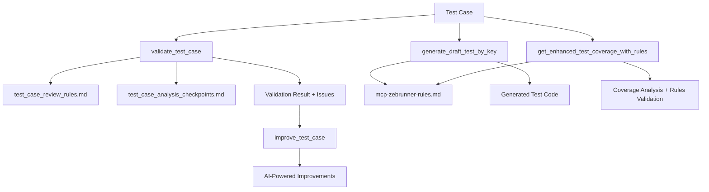

# Zebrunner MCP Server

<!--**Current version:** 🟢 --> <!--VERSION_START--><!--4.1.157--> <!--VERSION_END--> 

A **Model Context Protocol (MCP)** server that integrates with **Zebrunner Test Case Management** to help QA teams manage test cases, test suites, and test execution data through AI assistants like Claude.

> 📖 **Need help with installation?** Check out our [**Step-by-Step Install Guide**](INSTALL-GUIDE.md) for detailed setup instructions.
> 
> 🚀 **Installing via npm?** See our [**MCP NPM Installation Guide**](MCP_NPM_INSTALLATION_GUIDE.md) for Claude Desktop, Cursor, IntelliJ IDEA, and ChatGPT Desktop configuration.

## 📑 Table of Contents

1. [🎯 What is this tool?](#-what-is-this-tool)
2. [🧠 Intelligent Rules System](#-intelligent-rules-system)
   - 2.1. [What Makes This Tool Special](#what-makes-this-tool-special)
   - 2.2. [How the Rules Work Together](#how-the-rules-work-together)
   - 2.3. [Why This Matters](#why-this-matters)
   - 2.4. [Customizing Rules for Your Project](#customizing-rules-for-your-project)
3. [📋 Prerequisites](#-prerequisites)
4. [🚀 Quick Start Guide](#-quick-start-guide)
5. [🔧 Usage Methods](#-usage-methods)
   - 5.1. [Method 1: Use with Claude Desktop/Code](#method-1-use-with-claude-desktopcode-recommended)
   - 5.2. [Method 2: Run as standalone server](#method-2-run-as-standalone-server)
   - 5.3. [Method 3: Smart URL-Based Analysis 🚀](#method-3-smart-url-based-analysis-)
6. [🛠️ Available Tools](#️-available-tools)
   - 6.1. [📋 Test Case Management](#-test-case-management)
   - 6.2. [🌳 Test Suite Hierarchy & Organization](#-test-suite-hierarchy--organization)
   - 6.3. [🔍 Test Coverage & Analysis](#-test-coverage--analysis)
   - 6.4. [🧪 Test Code Generation & Validation](#-test-code-generation--validation)
   - 6.5. [🚀 Launch & Execution Management](#-launch--execution-management)
   - 6.6. [📊 Reporting & Analytics](#-reporting--analytics)
   - 6.7. [🏃 Test Run Management](#-test-run-management)
   - 6.8. [🎯 Management-Focused Quick Commands](#-management-focused-quick-commands)
7. [🎭 Role-Specific Prompts & Workflows](#-role-specific-prompts--workflows)
   - <details><summary>7.1. 👩‍💻 Manual QA Engineers</summary>
     
     - [Daily Test Case Review](#daily-test-case-review)
     - [Test Case Creation & Improvement](#test-case-creation--improvement)
     - [Test Suite Organization](#test-suite-organization)
     - [Coverage Analysis](#coverage-analysis)
     </details>
   - <details><summary>7.2. 🤖 Test Automation Engineers & SDETs</summary>
     
     - [Automation Readiness Assessment](#automation-readiness-assessment)
     - [Test Code Generation](#test-code-generation-1)
     - [Coverage Analysis & Validation](#coverage-analysis--validation)
     - [Framework Integration](#framework-integration)
     - [Batch Automation Analysis](#batch-automation-analysis)
     </details>
   - <details><summary>7.3. 👨‍💻 Developers</summary>
     
     - [Test Case Understanding](#test-case-understanding)
     - [Implementation Validation](#implementation-validation)
     - [Code Generation for Testing](#code-generation-for-testing)
     - [Bug Analysis](#bug-analysis)
     </details>
   - <details><summary>7.4. 👔 Test Managers & Team Leads</summary>
     
     - [Team Quality Metrics](#team-quality-metrics)
     - [Test Suite Analysis](#test-suite-analysis)
     - [Team Performance & Planning](#team-performance--planning)
     - [Process Improvement](#process-improvement)
     - [Reporting & Stakeholder Communication](#reporting--stakeholder-communication)
     </details>
   - <details><summary>7.5. 🏢 Project Owners & Product Managers</summary>
     
     - [Project Health Overview](#project-health-overview)
     - [Feature Testing Status](#feature-testing-status)
     - [Quality Assurance Metrics](#quality-assurance-metrics)
     - [Risk Assessment](#risk-assessment)
     - [Planning & Resource Allocation](#planning--resource-allocation)
     </details>
8. [📖 Output Formats](#-output-formats)
9. [⚙️ Configuration Options](#️-configuration-options)
10. [🧪 Testing Your Setup](#-testing-your-setup)
11. [🔍 Troubleshooting](#-troubleshooting)
12. [🎯 Example Workflows](#-example-workflows)
13. [🔧 Advanced Features](#-advanced-features)
14. [📚 Additional Documentation](#-additional-documentation)
15. [🤝 Contributing](#-contributing)
16. [📄 License](#-license)
17. [🎉 You're Ready!](#-youre-ready)

---

## 🎯 What is this tool?

This tool allows you to:
- **Retrieve test cases** and test suites from Zebrunner
- **Analyze test coverage** and generate test code
- **Get test execution results** and launch details
- **Validate test case quality** with automated checks using intelligent rules
- **Generate reports** and insights from your test data
- **Improve test cases** with AI-powered suggestions and automated fixes

All through natural language commands in AI assistants!

[⬆️ Back to top](#-table-of-contents)

## 🧠 Intelligent Rules System

### What Makes This Tool Special

Our MCP server includes a sophisticated **3-tier rules system** that transforms how you work with test cases:

#### 🎯 **Test Case Review Rules** (`test_case_review_rules.md`)
- **Purpose**: Core quality standards and writing guidelines
- **What it does**: Defines fundamental principles for writing high-quality test cases
- **Key areas**: Independence, single responsibility, comprehensive preconditions, complete step coverage
- **Used by**: `validate_test_case` and `improve_test_case` tools

#### ✅ **Test Case Analysis Checkpoints** (`test_case_analysis_checkpoints.md`)
- **Purpose**: Detailed validation checklist with 100+ checkpoints
- **What it does**: Provides granular validation criteria for thorough test case analysis
- **Key areas**: Structure validation, automation readiness, platform considerations, quality assurance
- **Used by**: `validate_test_case` for comprehensive scoring and issue detection

#### ⚙️ **MCP Zebrunner Rules** (`mcp-zebrunner-rules.md`)
- **Purpose**: Technical configuration for test generation and coverage analysis
- **What it does**: Defines framework detection patterns, code templates, and coverage thresholds
- **Key areas**: Framework detection, test generation templates, coverage thresholds, quality standards
- **Used by**: `generate_draft_test_by_key` and `get_enhanced_test_coverage_with_rules` tools

### How the Rules Work Together



### Why This Matters

1. **Consistency**: All team members follow the same quality standards
2. **Automation**: Reduce manual review time with automated validation
3. **Learning**: New team members learn best practices through AI feedback
4. **Customization**: Adapt rules to your project's specific needs
5. **Continuous Improvement**: AI suggests improvements based on proven patterns

### Customizing Rules for Your Project

You can customize any of the three rules files:

```bash
# Copy default rules to customize
cp test_case_review_rules.md my-project-review-rules.md
cp test_case_analysis_checkpoints.md my-project-checkpoints.md
cp mcp-zebrunner-rules.md my-project-technical-rules.md

# Use custom rules in validation
"Validate test case PROJ-123 using custom rules from my-project-review-rules.md"
```

**Example customizations:**
- **Mobile projects**: Add mobile-specific validation rules
- **API projects**: Focus on API testing patterns and data validation
- **Different frameworks**: Customize code generation templates
- **Company standards**: Align with your organization's testing guidelines

[⬆️ Back to top](#-table-of-contents)

## 📋 Prerequisites

### What you need to know
- **Basic command line usage** (opening terminal, running commands)
- **Your Zebrunner credentials** (login and API token)
- **Basic understanding of test management** (test cases, test suites)

### Software requirements
- **Node.js 18 or newer** - [Download here](https://nodejs.org/)
- **npm** (comes with Node.js)
- **Access to a Zebrunner instance** with API credentials

### How to check if you have Node.js
Open your terminal/command prompt and run:
```bash
node --version
npm --version
```
If you see version numbers, you're ready to go!

[⬆️ Back to top](#-table-of-contents)

## 🚀 Quick Start Guide

> 💡 **Want more detailed instructions?** Check out our [**More Detailed Step-by-step Install Guide**](INSTALL-GUIDE.md) with troubleshooting tips and platform-specific instructions.

### Step 1: Get the code
Choose one of these methods:

#### Option A: Clone from repository (recommended)
```bash
git clone https://github.com/maksimsarychau/mcp-zebrunner.git
cd mcp-zebrunner
```

#### Option B: Download and extract
Download the project files and extract them to a folder.

### Step 2: Install dependencies
```bash
npm install
```

### Step 3: Configure your Zebrunner connection
Create a `.env` file in the project folder with your Zebrunner details:

```env
# Your Zebrunner instance URL (without trailing slash)
ZEBRUNNER_URL=https://your-company.zebrunner.com/api/public/v1

# Your Zebrunner login (usually your email)
ZEBRUNNER_LOGIN=your.email@company.com

# Your Zebrunner API token (get this from your Zebrunner profile)
ZEBRUNNER_TOKEN=your_api_token_here

# Optional: Enable debug logging (default: false)
DEBUG=false

# Optional: Enable intelligent rules system (auto-detected if rules file exists)
ENABLE_RULES_ENGINE=true
```

#### How to get your Zebrunner API token:
1. Log into your Zebrunner instance
2. Go to your profile settings
3. Find the "API Access" section
4. Generate a new API token
5. Copy the token to your `.env` file

### Step 4: Build the project
```bash
npm run build
```

### Step 5: Test your connection
```bash
npm run test:health
```
If you see "✅ Health check completed", you're ready to go!

## 🔄 Updating to New Version

### Check current version
```bash
# Check your current version
npm run version
# or manually check package.json
cat package.json | grep '"version"'
```

### Update steps
```bash
# 1. Pull latest changes from master branch
git pull origin master

# 2. Install any new dependencies
npm install

# 3. Rebuild the project
npm run build

# 4. Test your connection (requires valid .env file)
npm run test:health
```

**Important Notes:**
- ✅ **Your `.env` file must be properly configured** for the health check to work
- ✅ **Restart Claude Desktop/Code** after updating to reload the MCP server
- ✅ **Check release notes** for any breaking changes before updating

If the health check fails, verify your `.env` configuration and Zebrunner credentials.

[⬆️ Back to top](#-table-of-contents)

## 🔧 Usage Methods

### Method 1: Use with Claude Desktop/Code (Recommended)

Add this configuration to your Claude Desktop or Claude Code settings. **Important:** You must use the full absolute path to your project folder.

```json
{
  "mcpServers": {
    "mcp-zebrunner": {
      "command": "node",
      "args": ["/full/absolute/path/to/mcp-zebrunner/dist/server.js"],
      "env": {
        "ZEBRUNNER_URL": "https://your-company.zebrunner.com/api/public/v1",
        "ZEBRUNNER_LOGIN": "your.email@company.com",
        "ZEBRUNNER_TOKEN": "your_api_token_here",
        "DEBUG": "false",
        "ENABLE_RULES_ENGINE": "true",
        "DEFAULT_PAGE_SIZE": "100",
        "MAX_PAGE_SIZE": "100"
      }
    }
  }
}
```

**Example paths:**
- **Windows:** `C:\\Users\\YourName\\Projects\\mcp-zebrunner\\dist\\server.js`
- **macOS/Linux:** `/Users/YourName/Projects/mcp-zebrunner/dist/server.js`

### Alternative: Command Line Integration (Claude Code)

You can also add the server using the command line:

```bash
claude mcp add mcp-zebrunner \
  --env ZEBRUNNER_URL="https://your-company.zebrunner.com/api/public/v1" \
  --env ZEBRUNNER_LOGIN="your.email@company.com" \
  --env ZEBRUNNER_TOKEN="your_api_token_here" \
  --env DEBUG="false" \
  --env ENABLE_RULES_ENGINE="true" \
  -- node /full/absolute/path/to/mcp-zebrunner/dist/server.js
```

**Important:** Replace `/full/absolute/path/to/mcp-zebrunner/` with the actual full path to your project folder.

### Method 2: Run as standalone server

#### Development mode (with auto-reload)
```bash
npm run dev
```

#### Production mode
```bash
npm start
```

### Method 3: Smart URL-Based Analysis 🚀

**NEW in v5.4.1+**: Claude can automatically detect Zebrunner URLs and analyze them with optimal settings!

Just paste a Zebrunner URL in your conversation, and Claude will automatically:
- Parse the URL to extract project, launch, and test IDs
- Call the appropriate analysis tool
- Use recommended settings (videos, screenshots, AI analysis enabled)

#### 📋 Supported URL Patterns

**1. Test Analysis URLs**
```
https://your-workspace.zebrunner.com/projects/PROJECT/automation-launches/LAUNCH_ID/tests/TEST_ID
```

**What happens:**
- Claude automatically calls `analyze_test_failure`
- Extracts: `projectKey`, `testRunId` (launch ID), `testId`
- Enables: `includeVideo: true`, `analyzeScreenshotsWithAI: true`, all diagnostics

**Example:**
```
User: "Analyze https://your-workspace.zebrunner.com/projects/MCP/automation-launches/120911/tests/5455386"

Claude automatically calls:
{
  projectKey: "MCP",
  testRunId: 120911,
  testId: 5455386,
  includeVideo: true,
  analyzeScreenshotsWithAI: true,
  includeLogs: true,
  includeScreenshots: true,
  analyzeSimilarFailures: true,
  screenshotAnalysisType: "detailed",
  format: "detailed"
}
```

**2. Launch Analysis URLs**
```
https://your-workspace.zebrunner.com/projects/PROJECT/automation-launches/LAUNCH_ID
```

**What happens:**
- Claude automatically calls `detailed_analyze_launch_failures`
- Extracts: `projectKey`, `testRunId` (launch ID)
- Enables: `includeScreenshotAnalysis: true`, comprehensive analysis

**Example:**
```
User: "Analyze https://your-workspace.zebrunner.com/projects/MCP/automation-launches/120911"

Claude automatically calls:
{
  projectKey: "MCP",
  testRunId: 120911,
  filterType: "without_issues",
  includeScreenshotAnalysis: true,
  screenshotAnalysisType: "detailed",
  format: "summary",
  executionMode: "sequential"
}
```

#### ✨ Advanced Usage

**Override Default Settings**

Claude understands natural language overrides:

```
User: "Analyze https://...url... but without screenshots"
→ Claude sets: analyzeScreenshotsWithAI: false

User: "Analyze https://...url... in jira format"
→ Claude sets: format: "jira"

User: "Quick analysis of https://...url..."
→ Claude sets: format: "summary", screenshotAnalysisType: "basic"
```

**Multiple URLs**

Analyze multiple tests/launches in one request:

```
User: "Compare these failures:
https://your-workspace.zebrunner.com/projects/MCP/automation-launches/120911/tests/5455386
https://your-workspace.zebrunner.com/projects/MCP/automation-launches/120911/tests/5455390"

→ Claude analyzes both sequentially and compares results
```

**Cross-Workspace Support**

⚠️ URLs from different workspaces will show a warning but still attempt analysis:

```
User: "Analyze https://other-workspace.zebrunner.com/..."
→ Claude warns: "URL is from 'other-workspace.zebrunner.com' but configured workspace is 'your-workspace.zebrunner.com'"
→ Proceeds with analysis using available credentials
```

#### 📖 URL Pattern Reference

| Component | Example | Extracted As | Used In Tool |
|-----------|---------|--------------|--------------|
| Workspace | `your-workspace.zebrunner.com` | Validation only | N/A |
| Project Key | `MCP` | `projectKey` | All tools |
| Launch ID | `120911` | `testRunId` | All tools |
| Test ID | `5455386` | `testId` | `analyze_test_failure` only |

#### 🎯 Why Use URL-Based Analysis?

✅ **Faster**: No need to manually specify IDs  
✅ **Convenient**: Copy-paste URLs directly from Zebrunner UI  
✅ **Optimized**: Automatic use of recommended settings  
✅ **Smart**: Claude detects intent and adjusts parameters  
✅ **Flexible**: Natural language overrides work seamlessly  

#### 💡 Pro Tips

1. **Direct from Zebrunner**: Copy URL directly from your browser while viewing a test/launch
2. **Batch Analysis**: Paste multiple URLs separated by newlines
3. **Custom Settings**: Add natural language instructions to override defaults
4. **Quick Checks**: URLs work great for quick "what happened here?" questions
5. **Reports**: Combine with format requests: "Generate JIRA ticket for https://...url..."

[⬆️ Back to top](#-table-of-contents)

## 🛠️ Available Tools

Once connected, you can use these tools through natural language in your AI assistant. Here's a comprehensive reference of all 33+ available tools organized by category:

### 📋 Test Case Management

#### **Core Test Case Tools**
| Tool | Description | Example Usage | Best For |
|------|-------------|---------------|----------|
| `get_test_case_by_key` | Get detailed test case information | `"Get test case MCP-123 details"` | All roles |
| `get_test_cases_advanced` | Advanced filtering with automation states, dates | `"Get test cases created after 2024-01-01 with automation state 'Manual'"` | QA, SDETs |
| `get_test_cases_by_automation_state` | Filter by specific automation states | `"Show me all 'Not Automated' test cases in project MCP"` | SDETs, Managers |
| `get_test_case_by_title` | Search test cases by title (partial match) | `"Find test cases with title containing 'login functionality'"` | All roles |
| `get_test_case_by_filter` | Advanced filtering by suite, dates, priority, automation state | `"Get test cases from suite 491 created after 2024-01-01 with high priority"` | QA, Managers |
| `get_automation_states` | List available automation states | `"What automation states are available for project MCP?"` | All roles |
| `get_automation_priorities` | List available priorities with IDs | `"Show me all priority levels for project MCP"` | All roles |

#### **Batch Test Case Operations**
| Tool | Description | Example Usage | Best For |
|------|-------------|---------------|----------|
| `get_all_tcm_test_cases_by_project` | Get ALL test cases (handles pagination) | `"Get all test cases for project MCP"` | Managers, Leads |
| `get_all_tcm_test_cases_with_root_suite_id` | All test cases with hierarchy info | `"Get all test cases with their root suite information"` | Analysts |

### 🌳 Test Suite Hierarchy & Organization

#### **Suite Management**
| Tool | Description | Example Usage | Best For |
|------|-------------|---------------|----------|
| `list_test_suites` | List suites with pagination | `"List test suites for project MCP"` | All roles |
| `get_suite_hierarchy` | Hierarchical tree view | `"Show me the hierarchy of test suites with depth 3"` | Managers, QA |
| `get_root_suites` | Get top-level suites | `"Show me all root suites for project MCP"` | Managers |
| `get_all_subsuites` | Get all child suites | `"Get all subsuites from root suite 18697"` | QA, Analysts |

#### **Suite Analysis Tools**
| Tool | Description | Example Usage | Best For |
|------|-------------|---------------|----------|
| `get_tcm_suite_by_id` | Find specific suite by ID | `"Get details for suite 17470"` | All roles |
| `get_tcm_test_suites_by_project` | Comprehensive suite listing | `"Get all suites for project MCP with hierarchy"` | Managers |
| `get_root_id_by_suite_id` | Find root suite for any suite | `"What's the root suite for suite 12345?"` | Analysts |

### 🔍 Test Coverage & Analysis

#### **Coverage Analysis**
| Tool | Description | Example Usage | Best For |
|------|-------------|---------------|----------|
| `get_test_coverage_by_test_case_steps_by_key` | Analyze implementation coverage | `"Analyze coverage for MCP-123 against this code: [paste code]"` | Developers, SDETs |
| `get_enhanced_test_coverage_with_rules` | Rules-based coverage analysis | `"Enhanced coverage analysis for MCP-123 with framework detection"` | SDETs, Leads |

#### **Duplicate Analysis**
| Tool | Description | Example Usage | Best For |
|------|-------------|---------------|----------|
| `analyze_test_cases_duplicates` | Find and group similar test cases by step similarity | `"Analyze suite 12345 for duplicates with 80% similarity threshold"` | QA Managers, SDETs |
| `analyze_test_cases_duplicates_semantic` | Advanced semantic analysis with LLM-powered step clustering | `"Semantic analysis of suite 12345 with step clustering and medoid selection"` | Senior QA, Test Architects |

**🔗 Clickable Links Feature**: Both duplicate analysis tools support clickable links to Zebrunner web UI:
- Add `include_clickable_links: true` to make test case keys clickable in markdown output
- JSON/DTO formats automatically include `webUrl` fields when enabled
- Links are generated from your `ZEBRUNNER_URL` environment variable
- Example: `"Analyze suite 17585 for duplicates with clickable links enabled"`

### 🧪 Test Code Generation & Validation

#### **AI-Powered Tools**
| Tool | Description | Example Usage | Best For |
|------|-------------|---------------|----------|
| `generate_draft_test_by_key` | Generate test code with framework detection | `"Generate Java/Carina test for MCP-123 based on this implementation"` | SDETs, Developers |
| `validate_test_case` | Quality validation with improvement | `"Validate test case MCP-123 and suggest improvements"` | QA, Managers |
| `improve_test_case` | Dedicated improvement tool | `"Improve test case MCP-123 with specific suggestions"` | QA, SDETs |

### 🚀 Launch & Execution Management

#### **Launch Operations** ⭐ *Essential for Managers*
| Tool | Description | Example Usage | Best For |
|------|-------------|---------------|----------|
| `get_launch_details` | Comprehensive launch information | `"Get launch details for launch 118685"` | **Managers, Leads** |
| `get_launch_summary` | Quick launch overview | `"Show me summary for launch 118685"` | **Managers** |
| `get_all_launches_for_project` | All launches with pagination | `"Get all launches for project MCP from last month"` | **Managers, Leads** |
| `get_all_launches_with_filter` | Filter by milestone/build | `"Get launches for milestone 2.1.0 and build 'mcp-app-2.1.0'"` | **Managers, Leads** |

### 📊 Reporting & Analytics

#### **Test Failure Analysis** 🆕 *Game Changer*
| Tool | Description | Example Usage | Best For |
|------|-------------|---------------|----------|
| `analyze_test_failure` | Deep forensic analysis of failed tests with logs, screenshots, error classification, and recommendations. **NEW in v5.11.0:** Compare with last passed execution! Shows what changed (logs, duration, environment). **Also:** `format: 'jira'` generates ready-to-paste Jira tickets with auto-priority, labels, and clickable 🎥 video links! | `"Analyze test failure 5451420 in launch 120806 and compare with last passed execution"` | **QA Engineers, SDETs, Managers** |
| `get_test_execution_history` | 🆕 **NEW in v5.11.0!** Track test execution trends across launches. View pass/fail history, find last passed execution, calculate pass rate. **Critical Detection:** Highlights when test failed in all recent runs! | `"Show execution history for test 5478492"` or `"Has test 5478492 been failing consistently?"` | **QA Engineers, SDETs, Managers** |
| `detailed_analyze_launch_failures` | 🚀 **Enhanced v4.12.1** Analyze failures WITHOUT linked issues with **Claude-level intelligence** + **Jira format support**. Auto-deep-dive with executive summary, timeline, patterns, priorities. **NEW:** Generate Jira-ready tickets for entire launches! | `"Analyze failures in launch 120806"` or with `format: 'jira'` | **QA Managers, SDETs, Team Leads** |

> ✅ **FIXED in v5.2.4!** **Improved Reliability & Video Links**
> - **🎥 Video URLs fixed**: Now uses test-sessions API (`/api/reporting/v1/launches/{id}/test-sessions`) for reliable video artifact extraction
> - **🛡️ Comprehensive error handling**: Gracefully handles missing screenshots/logs (returns empty arrays instead of throwing)
> - **🚫 No more "no result received" errors**: All API calls have proper try-catch blocks with fallbacks
> - **🐛 Better debugging**: Enhanced logging when `debug: true` is enabled in config
> - **📊 Schema updates**: Supports both old and new API structures for backward compatibility
>
> 🎫 **NEW in v4.12.1!** **Jira-Ready Ticket Format**
> - Use `format: 'jira'` to generate ready-to-paste Jira tickets
> - **Auto-calculated priority** based on stability and impact
> - **Smart labels**: `test-automation`, `locator-issue`, `flaky-test`, etc.
> - **Complete Jira markup**: Tables, panels, code blocks, clickable links
> - **🎥 Prominent video links**: Beautiful panels + links section
> - **Copy-paste ready**: No manual formatting needed
> - **Saves 5-10 minutes per ticket** with consistent quality

> 🧠 **Enhanced in v4.11.1!** `detailed_analyze_launch_failures` provides **automatic deep synthesis** like Claude would manually provide:
> - **🎯 Executive Summary**: Key findings, patterns, and stability indicators
> - **📅 Timeline Analysis**: When failures first appeared, progression tracking
> - **🔬 Pattern Analysis**: Groups by root cause with affected tests and stability %
> - **🎯 Priority-Based Recommendations**: 🔴 HIGH / 🟡 MEDIUM / 🟢 LOW with impact analysis
> - **📋 Enhanced Test Details**: Full error messages, stack traces, timestamps
> - **❓ Smart Follow-up Questions**: Guides next investigation steps
> - **Smart filtering**: Analyzes only tests WITHOUT linked issues by default
> - Optional AI screenshot analysis for all tests
> - **No manual follow-up needed** - get complete picture in one call!

> 🆕 **NEW in v5.11.0!** **Test Execution History & Comparison**
> - **📊 Track execution trends**: View pass/fail history across launches with `get_test_execution_history`
> - **🔄 Compare with last passed**: New `compareWithLastPassed` parameter in `analyze_test_failure`
>   - Compare logs (new errors detection)
>   - Compare duration (performance regression)
>   - Compare environment (device/platform changes)
>   - Compare screenshots (visual differences)
> - **⚠️ Critical detection**: Automatically highlights when test failed in all recent executions
> - **🎯 Regression analysis**: See exactly what changed between passed and failed runs
> - **📈 Pass rate metrics**: Calculate test stability over time
> - See [TOOLS_CATALOG.md](TOOLS_CATALOG.md) for example prompts!

#### **Screenshot Analysis & Visual Forensics** 🎯 *Enhanced in v4.11.0*
| Tool | Description | Example Usage | Best For |
|------|-------------|---------------|----------|
| `download_test_screenshot` | Download protected screenshots from Zebrunner with authentication | `"Download screenshot from https://your-workspace.zebrunner.com/files/abc123 for test 5451420"` | **QA Engineers, Automation Engineers** |
| `analyze_screenshot` | Visual analysis with OCR, UI detection, and Claude Vision | `"Analyze screenshot https://your-workspace.zebrunner.com/files/abc123 with OCR and detailed analysis"` | **QA Engineers, SDETs, Developers** |

> 📸 **Enhanced!** Screenshot analysis now integrated directly into `analyze_test_failure` and `analyze_launch_failures` - no need to call separately! See [Screenshot Analysis Guide](docs/SCREENSHOT_ANALYSIS.md) for details.

#### **Platform & Results Analysis** ⭐ *Critical for Management*
| Tool | Description | Example Usage | Best For |
|------|-------------|---------------|----------|
| `get_platform_results_by_period` | Test results by platform/period | `"Get iOS test results for the last 7 days"` | **Managers, Leads** |
| `get_top_bugs` | Most frequent defects | `"Show me top 10 bugs from last week"` | **Managers, Developers** |
| `get_bug_review` | Detailed bug review with failure analysis, priority breakdown, and automatic detail fetching | `"Get bug review with full failure details for top 10 bugs"` | **Managers, QA, Developers** |
| `get_bug_failure_info` | Comprehensive failure info by hashcode (alternative to auto-fetch) | `"Get failure info for hashcode 1051677506"` | **Developers, SDETs** |
| `get_project_milestones` | Available milestones | `"Get all milestones for project MCP"` | **Managers, PMs** |

#### **Project Discovery**
| Tool | Description | Example Usage | Best For |
|------|-------------|---------------|----------|
| `get_available_projects` | Discover all accessible projects | `"What projects can I access?"` | All roles |
| `test_reporting_connection` | Test API connectivity | `"Test my connection to Zebrunner"` | All roles |

### 🏃 Test Run Management

#### **Public API Test Runs** ⭐ *Powerful for Analysis*
| Tool | Description | Example Usage | Best For |
|------|-------------|---------------|----------|
| `list_test_runs` | Advanced test run filtering | `"Get test runs from last 30 days with status 'FAILED'"` | **Managers, SDETs** |
| `get_test_run_by_id` | Detailed test run information | `"Get details for test run 12345"` | **Managers, QA** |
| `list_test_run_test_cases` | Test cases in a specific run | `"Show me all test cases in test run 12345"` | **QA, Analysts** |

#### **Configuration Management**
| Tool | Description | Example Usage | Best For |
|------|-------------|---------------|----------|
| `get_test_run_result_statuses` | Available result statuses | `"What result statuses are configured for project MCP?"` | QA, SDETs |
| `get_test_run_configuration_groups` | Configuration options | `"Show me configuration groups for project MCP"` | SDETs, Leads |

## 🎯 Management-Focused Quick Commands

### **📈 Daily Standup Reports**
```bash
# Get yesterday's results
"Get platform results for last 7 days for project MCP"

# Check recent failures  
"Show me top 5 bugs from last week"

# Review recent launches
"Get all launches for project MCP from last 3 days"
```

### **🔍 Test Suite Optimization**
```bash
# Basic duplicate analysis
"Analyze suite 12345 for duplicates with 80% similarity threshold"

# Advanced semantic analysis with step clustering
"Semantic analysis of suite 12345 with 85% step clustering and medoid selection"

# Analyze specific test cases for duplicates
"Analyze test cases MCP-123, MCP-124, MCP-125 for duplicates"

# Project-wide duplicate analysis (use with caution - large datasets)
"Analyze project MCP for test case duplicates with 85% similarity"

# Get detailed similarity matrix with pattern types
"Analyze suite 12345 for duplicates with similarity matrix included"

# Two-phase clustering with semantic insights
"Semantic duplicate analysis with step clustering threshold 90% and insights enabled"

# Enable clickable links for easy navigation
"Analyze suite 17585 for duplicates with clickable links enabled"
```

### **📊 Weekly Management Reports**
```bash
# Comprehensive project health
"Get all launches for project MCP with milestone filter"

# Platform performance analysis
"Get iOS and Android test results for the last month"

# Quality metrics
"Get all test cases by automation state for project MCP"
```

### **🎯 Milestone & Release Planning**
```bash
# Milestone tracking
"Get project milestones for MCP with completion status"

# Build-specific results
"Get launches for build 'mcp-app-2.1.0-release' and milestone '2.1.0'"

# Release readiness
"Get automation readiness for all test cases in project MCP"
```

### **🐞 Issue Analysis & Troubleshooting**
```bash
# Bug analysis
"Show me top 10 most frequent bugs with issue links"

# Failure investigation
"Get test run 12345 details with all test cases"

# Platform-specific issues
"Get Android test results for last 7 days with failure analysis"
```

[⬆️ Back to top](#-table-of-contents)

## 🎭 Role-Specific Prompts & Workflows

### 👩‍💻 Manual QA Engineers

#### Daily Test Case Review
```
"Get test case MCP-45 details and validate its quality"
"Show me all test cases in suite 18708 that need improvement"
"Validate test case MCP-67 and suggest specific improvements"
"Find test cases with title containing 'login' to review authentication tests"
"Get test cases from suite 491 with high priority for today's testing"
```

#### Test Case Creation & Improvement
```
"I'm writing a test case for login functionality. What should I include based on our quality standards?"
"Improve test case MCP-89 - it's missing some preconditions"
"Check if test case MCP-12 is ready for manual execution"
```

#### Test Suite Organization
```
"Show me the hierarchy of test suites for project MYAPP to understand the structure"
"Get all subsuites from Authentication suite to review test coverage"
"List test cases in suite 18708 and identify which ones need validation"
"Find test cases with title containing 'payment' to organize payment testing"
"Get all high priority test cases from suite 491 for release testing"
```

#### Coverage Analysis
```
"I executed test case MCP-34 manually. Here's what I did: [paste your execution notes]. Analyze coverage against the documented steps."
"Compare test case MCP-56 with this manual testing session: [paste session details]"
```

### 🤖 Test Automation Engineers & SDETs

#### Automation Readiness Assessment
```
"Validate test case MCP-78 for automation readiness"
"Get all test cases in suite 18708 and identify which ones are ready for automation"
"Check test case MCP-23 - does it have clear, unambiguous steps for automation?"
"Find test cases with title containing 'API' to prioritize API automation"
"Get automation priorities to understand which test cases to automate first"
"Get test cases from suite 491 with 'Not Automated' state for automation planning"
```

#### Test Code Generation
```
"Generate Java/Carina test code for MCP-45 based on this existing framework: [paste framework code]"
"Create JavaScript/Jest test for MCP-67 using this test structure: [paste test example]"
"Generate Python/Pytest code for MCP-89 with these page objects: [paste page object code]"
```

#### Coverage Analysis & Validation
```
"Analyze test coverage for MCP-34 against this automated test: [paste test code]"
"Enhanced coverage analysis for MCP-56 with rules validation - here's my implementation: [paste code]"
"Compare test case MCP-78 steps with this Selenium test: [paste selenium code]"
```

#### Framework Integration
```
"Generate test code for MCP-45 using our Carina framework with these page objects: [paste existing code]"
"Create test automation for MCP-67 that integrates with this CI/CD pipeline: [paste pipeline config]"
"Generate API test for MCP-89 using this RestAssured setup: [paste API test framework]"
```

#### Batch Automation Analysis
```
"Validate all test cases in Authentication suite for automation readiness"
"Generate coverage report for all test cases in project MYAPP"
"Identify test cases in suite 18708 that have automation blockers"
"Find test cases with title containing 'regression' for automation sprint planning"
"Get test cases from suite 491 created after 2024-01-01 with high priority for next automation cycle"
"Get automation priorities and states to create automation roadmap"
```

### 👨‍💻 Developers

#### Test Case Understanding
```
"Get test case MCP-45 details to understand what I need to implement"
"Show me test cases related to login functionality in project MYAPP"
"Explain test case MCP-67 requirements in developer-friendly format"
"Find test cases with title containing 'authentication' for my feature development"
"Get high priority test cases from suite 491 that I need to implement"
```

#### Implementation Validation
```
"I implemented this feature: [paste code]. Analyze coverage against test case MCP-34"
"Here's my API implementation: [paste code]. Check coverage against test case MCP-56"
"Validate my UI implementation against test case MCP-78: [paste component code]"
```

#### Code Generation for Testing
```
"Generate unit tests for test case MCP-45 using Jest framework"
"Create integration tests for MCP-67 based on this API: [paste API code]"
"Generate test data setup for MCP-89 using this database schema: [paste schema]"
```

#### Bug Analysis
```
"Get test execution results for launch 118685 to understand recent failures"
"Show me top bugs from last week related to my feature area"
"Get detailed bug review for Android project from last 14 days"
"Show me comprehensive failure information for hashcode 1051677506"
"What are the top 50 bugs affecting our project this month?"
"Give me a summary of bug failures with reproduction dates from last 7 days"
"Analyze test case MCP-34 - why might it be failing in automation?"
```

### 👔 Test Managers & Team Leads

#### Team Quality Metrics
```
"Get quality metrics for all test cases in project MYAPP"
"Show me test cases that need improvement in suite 18708"
"Generate quality report for test cases created this month"
"Find test cases with title containing 'critical' to assess critical path quality"
"Get automation priorities to align team efforts with business priorities"
"Get test cases from suite 491 with high priority that need quality improvements"
```

#### Test Suite Analysis
```
"Show me the complete test suite hierarchy for project MYAPP"
"Analyze test coverage across all suites in project MYAPP"
"Get automation readiness status for all test cases in Authentication suite"
```

#### Team Performance & Planning
```
"Get test execution results by platform for the last 30 days"
"Show me top 10 most frequent bugs to prioritize fixes"
"Analyze test case quality trends in project MYAPP"
"Get all launches for project MYAPP from last 30 days with milestone tracking"
"Show me platform results for last 7 days to track team performance"
"Get test runs with status 'FAILED' from last week for team retrospective"
```

#### Process Improvement
```
"Validate all test cases in suite 18708 to identify common quality issues"
"Generate improvement recommendations for test cases created by junior team members"
"Analyze which test cases are consistently failing automation"
"Get top 10 bugs from last month to identify process improvements"
"Show me test runs with detailed failure analysis for process optimization"
"Get automation readiness metrics across all test cases"
"Find test cases with title containing 'flaky' to address test stability"
"Get test cases from suite 491 with medium priority that could be automated"
"Get automation priorities to optimize team resource allocation"
```

#### Reporting & Stakeholder Communication
```
"Generate comprehensive test coverage report for project MYAPP in markdown format"
"Get test execution summary for launch 118685 for stakeholder presentation"
"Show me test quality metrics and improvement suggestions for quarterly review"
"Get platform results by period for executive dashboard"
"Create milestone progress report with test execution data"
"Generate weekly team performance report with launch and bug metrics"
```

#### Daily Management Tasks
```
"Get all launches for project MYAPP from yesterday"
"Show me top 5 bugs from last 7 days with issue links"
"Get platform results for iOS and Android from last week"
"Check automation readiness for upcoming release milestone"
"Get test run details for failed runs from last 24 hours"
"Show me project milestones and their completion status"
```

### 🏢 Project Owners & Product Managers

#### Project Health Overview
```
"Get overall test coverage status for project MYAPP"
"Show me test execution results by platform for the last quarter"
"Generate project testing health report in markdown format"
"Get all launches for project MYAPP with milestone and build tracking"
"Show me platform results summary for executive review"
"Get project milestones with completion status and testing metrics"
```

#### Feature Testing Status
```
"Get test cases related to [feature name] in project MYAPP"
"Show me test execution results for [feature name] functionality"
"Analyze test coverage for [epic/story] requirements"
"Get launches filtered by milestone for feature release tracking"
"Show me test runs for specific build versions"
```

#### Quality Assurance Metrics
```
"Get quality metrics for all test cases in project MYAPP"
"Show me test case validation results and improvement areas"
"Generate testing quality report for stakeholder presentation"
"Get top bugs analysis for quality trend assessment"
"Show me automation vs manual testing ratio across the project"
"Find test cases with title containing 'smoke' to assess smoke test coverage"
"Get automation priorities to communicate testing strategy to stakeholders"
"Get test cases from suite 491 with critical priority for risk assessment"
```

#### Risk Assessment
```
"Show me top 10 most frequent bugs in project MYAPP"
"Get test cases that are not ready for automation and assess risk"
"Analyze test execution trends to identify potential quality risks"
"Get platform-specific failure rates for the last month"
"Show me test runs with high failure rates for risk mitigation"
"Get milestone-based testing progress for release risk assessment"
```

#### Planning & Resource Allocation
```
"Get automation readiness assessment for all test cases in project MYAPP"
"Show me test cases that need quality improvement and estimate effort"
"Analyze test suite structure to identify optimization opportunities"
"Get testing resource utilization by platform and time period"
"Show me milestone testing progress for sprint planning"
"Get comprehensive launch analysis for capacity planning"
"Find test cases with title containing 'performance' to plan performance testing"
"Get automation priorities to allocate automation resources effectively"
"Get test cases from suite 491 created in last month to plan review sessions"
```

#### Executive Reporting
```
"Generate executive dashboard with platform results and bug trends"
"Get quarterly testing metrics with milestone progress"
"Show me ROI analysis of automation vs manual testing efforts"
"Create board-ready testing status report with key metrics"
"Get testing velocity trends for project timeline assessment"
```

[⬆️ Back to top](#-table-of-contents)

## 📖 Output Formats

All tools support multiple output formats:

- **`json`** - Structured data (default)
- **`markdown`** - Rich formatted output with sections and tables
- **`string`** - Human-readable text summaries
- **`dto`** - Raw data objects

Example:
```
"Get test case PROJ-123 in markdown format"
"Show me test suites as JSON"
```

[⬆️ Back to top](#-table-of-contents)

## ⚙️ Configuration Options

### Environment Variables

```env
# Required
ZEBRUNNER_URL=https://your-instance.zebrunner.com/api/public/v1
ZEBRUNNER_LOGIN=your.email@company.com
ZEBRUNNER_TOKEN=your_api_token

# Optional - Basic Settings
DEBUG=false                        # Enable detailed logging (default: false)
DEFAULT_PAGE_SIZE=100             # Default items per page (optional)
MAX_PAGE_SIZE=100                 # Maximum items per page (optional)

# Optional - Intelligent Rules System
ENABLE_RULES_ENGINE=true          # Enable intelligent rules (auto-detected if rules file exists)
MCP_RULES_FILE=custom-rules.md    # Custom technical rules file (optional)
MIN_COVERAGE_THRESHOLD=70         # Minimum coverage percentage (optional)
REQUIRE_UI_VALIDATION=true        # Require UI validation in tests (optional)
REQUIRE_API_VALIDATION=true       # Require API validation in tests (optional)
```

### Rules System Configuration

The rules system automatically detects and uses rules files in your project root:

#### Automatic Detection
If you have a `mcp-zebrunner-rules.md` file in your project root, the rules engine will automatically enable itself.

#### Custom Rules Files
You can customize the three types of rules:

1. **Test Case Review Rules** (`test_case_review_rules.md`)
```markdown
# Custom Test Case Review Rules

## Rule 1: Title Quality
- Titles must be descriptive and specific
- Minimum length: 10 characters
- Should not contain vague terms like "test", "check"

## Rule 2: Test Steps
- Each step must have clear action and expected result
- Steps should be numbered and sequential
- Avoid combining multiple actions in one step
```

2. **Analysis Checkpoints** (`test_case_analysis_checkpoints.md`)
```markdown
# Custom Analysis Checkpoints

## Independence Assessment
- [ ] Can this test case run independently?
- [ ] Are all preconditions explicitly stated?
- [ ] No dependencies on other test cases?

## Automation Readiness
- [ ] All steps are unambiguous?
- [ ] Technical feasibility confirmed?
- [ ] Stable selectors available?
```

3. **Technical Rules** (`mcp-zebrunner-rules.md`)
```markdown
# Technical Configuration

## Coverage Thresholds
- Overall Coverage: 80%
- Critical Steps: 95%
- UI Validation Steps: 85%

## Framework Detection
**Java/TestNG**:
- Keywords: @Test, TestNG, WebDriver
- File patterns: *Test.java, *Tests.java
```

[⬆️ Back to top](#-table-of-contents)

## 🧪 Testing Your Setup

### Run health checks
```bash
npm run test:health
```

### Test API connection
```bash
npm run smoke
```

### Run full test suite
```bash
npm test
```

### Run specific test types
```bash
npm run test:unit           # Fast unit tests
npm run test:integration    # API integration tests
npm run test:e2e           # End-to-end tests
```

[⬆️ Back to top](#-table-of-contents)

## 🔍 Troubleshooting

### Common Issues

#### "Authentication failed" or 401 errors
- ✅ Check your `ZEBRUNNER_LOGIN` and `ZEBRUNNER_TOKEN`
- ✅ Verify your API token is still valid
- ✅ Ensure your user has proper permissions in Zebrunner

#### "Project not found" or 404 errors
- ✅ Check the project key spelling (e.g., "MYAPP", not "myapp")
- ✅ Verify you have access to the project in Zebrunner
- ✅ Some endpoints may not be available on all Zebrunner instances

#### "Connection timeout" errors
- ✅ Check your `ZEBRUNNER_URL` is correct
- ✅ Ensure your network can reach the Zebrunner instance
- ✅ Try increasing timeout in configuration

#### MCP integration not working
- ✅ Verify the path to `dist/server.js` is correct
- ✅ Check that the project built successfully (`npm run build`)
- ✅ Ensure environment variables are set in MCP configuration
- ✅ Look at Claude Desktop/Code logs for error messages

#### Rules engine not working
- ✅ Check that `ENABLE_RULES_ENGINE=true` in your `.env` file
- ✅ Verify rules files exist and have meaningful content
- ✅ Restart the MCP server after changing rules files
- ✅ Check debug logs for rules parsing errors

### Debug Mode

Enable detailed logging to troubleshoot issues:

```env
DEBUG=true
```

This will show:
- API requests and responses
- Error details and stack traces
- Performance metrics
- Feature availability
- Rules parsing and validation details

### Getting Help

1. **Check the logs** - Enable debug mode and look for error messages
2. **Test your connection** - Run `npm run test:health`
3. **Verify your configuration** - Double-check your `.env` file
4. **Check Zebrunner permissions** - Ensure your user has proper access
5. **Validate rules files** - Ensure rules files have meaningful content

[⬆️ Back to top](#-table-of-contents)

## 🎯 Example Workflows

### Workflow 1: Test Case Review (Manual QA)
```
1. "Get test case PROJ-123 details"
2. "Validate test case PROJ-123"
3. "Improve test case PROJ-123 with specific suggestions"
4. "Check if test case PROJ-123 is ready for manual execution"
```

### Workflow 2: Test Automation (SDET)
```
1. "Validate test case PROJ-456 for automation readiness"
2. "Generate Java/Carina test code for PROJ-456"
3. "Analyze coverage between test case and my implementation"
4. "Get automation readiness assessment"
```

### Workflow 3: Implementation Validation (Developer)
```
1. "Get test case PROJ-789 details to understand requirements"
2. "Analyze coverage for PROJ-789 against my implementation"
3. "Generate unit tests based on test case requirements"
4. "Validate implementation completeness"
```

### Workflow 4: Quality Management (Team Lead)
```
1. "Get quality metrics for all test cases in project MYAPP"
2. "Show me test cases that need improvement"
3. "Generate team quality report"
4. "Identify automation readiness across the project"
```

### Workflow 5: Project Health (Product Manager)
```
1. "Get overall test coverage status for project MYAPP"
2. "Show me test execution results by platform"
3. "Generate project testing health report"
4. "Identify quality risks and improvement opportunities"
```

[⬆️ Back to top](#-table-of-contents)

## 🔧 Advanced Features

### Batch Operations
Process multiple test cases at once:
```
"Validate all test cases in suite 18708"
"Generate coverage report for all test cases in project MYAPP"
"Improve all test cases that have quality issues"
```

### Custom Output Formats
Get data in the format you need:
```
"Get test cases as JSON for API integration"
"Show test suite hierarchy in markdown for documentation"
"Generate quality report in markdown for stakeholder presentation"
```

### Filtering and Search
Find exactly what you need:
```
"Get test cases created after 2024-01-01"
"Find test cases with automation state 'Manual'"
"Show me test cases that are not ready for automation"
```

### Rules-Based Analysis
Leverage intelligent validation:
```
"Validate test case PROJ-123 using custom rules from my-project-rules.md"
"Enhanced coverage analysis with framework-specific rules"
"Generate improvement suggestions based on team quality standards"
```

## 📚 Additional Documentation

### 📖 Tool References
- **[TOOLS_CATALOG.md](TOOLS_CATALOG.md)** - 🆕 **Complete catalog of all 40+ tools with natural language examples**
- **[INSTALL-GUIDE.md](INSTALL-GUIDE.md)** - 📥 **Step-by-step installation and setup guide**

### 🧠 Intelligent Rules System
- **[docs/INTELLIGENT_RULES_SYSTEM.md](docs/INTELLIGENT_RULES_SYSTEM.md)** - 🧠 **Complete guide to the 3-tier intelligent rules system**
- **[docs/RULES_QUICK_REFERENCE.md](docs/RULES_QUICK_REFERENCE.md)** - ⚡ **Quick reference for rules system commands and configuration**

### 📋 Rules Files (Customizable)
- **[test_case_review_rules.md](test_case_review_rules.md)** - 🎯 **Core quality standards and writing guidelines**
- **[test_case_analysis_checkpoints.md](test_case_analysis_checkpoints.md)** - ✅ **100+ detailed validation checkpoints**
- **[mcp-zebrunner-rules.md](mcp-zebrunner-rules.md)** - ⚙️ **Technical configuration for test generation and coverage analysis**

### 🔍 Specialized Guides
- **[docs/SCREENSHOT_ANALYSIS.md](docs/SCREENSHOT_ANALYSIS.md)** - 📸 **Screenshot download and visual analysis guide**
- **[change-logs.md](change-logs.md)** - 📝 **Version history and feature updates**

### 🛠️ Feature Documentation
- **[docs/NEW_LAUNCHER_TOOL.md](docs/NEW_LAUNCHER_TOOL.md)** - Detailed information about launch and reporting tools
- **[docs/SUITE_HIERARCHY.md](docs/SUITE_HIERARCHY.md)** - Complete guide to suite hierarchy features
- **[docs/TEST_CASE_VALIDATION_IMPLEMENTATION.md](docs/TEST_CASE_VALIDATION_IMPLEMENTATION.md)** - Test case validation system details
- **[docs/ENHANCED_VALIDATION_FEATURES.md](docs/ENHANCED_VALIDATION_FEATURES.md)** - Advanced validation and improvement features
- **[docs/SCREENSHOT_ANALYSIS.md](docs/SCREENSHOT_ANALYSIS.md)** - 📸 **Screenshot analysis and visual forensics guide** 🆕

[⬆️ Back to top](#-table-of-contents)

## 🤝 Contributing

1. Fork the repository
2. Create a feature branch
3. Make your changes with appropriate tests
4. Ensure all tests pass: `npm test`
5. Submit a pull request

## 📄 License

MIT License - see LICENSE file for details.

---

## 🎉 You're Ready!

Once you've completed the setup:

1. **Test your connection** with `npm run test:health`
2. **Configure your AI assistant** with the MCP server
3. **Start asking questions** about your test cases!

Example first commands to try:
- "List test suites for project [YOUR_PROJECT_KEY]"
- "Get test case [YOUR_TEST_CASE_KEY] details"
- "Validate test case [YOUR_TEST_CASE_KEY]"
- "Show me the test suite hierarchy"

The intelligent rules system will help ensure your test cases meet quality standards and are ready for both manual execution and automation. Happy testing! 🚀
