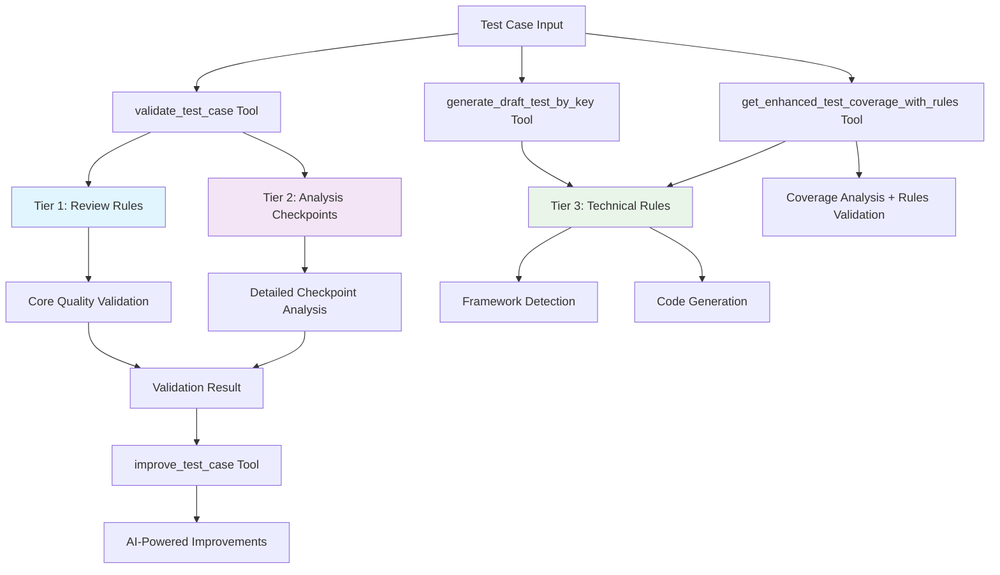

# Intelligent Rules System Guide

## Overview

The Zebrunner MCP Server includes a sophisticated **3-tier intelligent rules system** that transforms how you work with test cases. This system provides automated validation, improvement suggestions, and intelligent code generation based on configurable quality standards.

## The Three-Tier Architecture

### 🎯 Tier 1: Test Case Review Rules (`test_case_review_rules.md`)

**Purpose**: Fundamental quality standards and writing guidelines for test cases.

**What it validates**:
- **Independence Principle**: Each test case must be completely independent
- **Single Responsibility**: One specific test scenario per test case
- **Title Standards**: Clear, descriptive titles that communicate intent
- **Comprehensive Preconditions**: All necessary setup conditions explicitly stated
- **Complete Step Coverage**: All actions from beginning to end
- **Visual Documentation**: Proper use of images and annotations

**Used by**: 
- `validate_test_case` - Core validation engine
- `improve_test_case` - Improvement suggestions

**Example rules**:
```markdown
## Rule 4: Independence Principle
- Each test case must be completely independent
- Include ALL necessary preconditions and steps
- Previous test cases may be deleted or reorganized
- Review Check: Can this test case be executed in isolation?

## Rule 7: Title Standards
- Test case title should be one clear sentence
- Should communicate WHAT is being tested
- Review Check: Title alone should convey the test objective
```

### ✅ Tier 2: Test Case Analysis Checkpoints (`test_case_analysis_checkpoints.md`)

**Purpose**: Detailed validation checklist with 100+ granular checkpoints for comprehensive analysis.

**What it validates**:
- **Document Structure**: Logical hierarchy, clear naming, complete documentation
- **Independence Assessment**: Standalone execution, complete preconditions
- **Scope and Responsibility**: Single focus, clear objective, appropriate scope
- **Technical Quality**: Automation readiness, platform considerations, data security
- **Language and Clarity**: Professional language, consistent terminology
- **Completeness Validation**: End-to-end coverage, edge cases, error handling

**Used by**:
- `validate_test_case` - Detailed scoring and issue categorization
- Quality assessment algorithms

**Example checkpoints**:
```markdown
### ☐ Independence Assessment
- [ ] **Standalone Execution**: Can this test case run independently?
- [ ] **Complete Preconditions**: All necessary setup conditions stated?
- [ ] **No External Dependencies**: Doesn't rely on state from previous tests?
- [ ] **Self-Sufficient**: All required data and configurations included?

### ☐ Automation Readiness
- [ ] **Unambiguous Steps**: No interpretation required for any step?
- [ ] **Technical Feasibility**: All actions can be automated?
- [ ] **Stable Selectors**: UI elements can be reliably identified?
```

### ⚙️ Tier 3: MCP Zebrunner Rules (`mcp-zebrunner-rules.md`)

**Purpose**: Technical configuration for test generation, coverage analysis, and framework detection.

**What it defines**:
- **Coverage Thresholds**: Minimum coverage percentages for different validation types
- **Framework Detection Patterns**: Keywords, file patterns, and imports for different test frameworks
- **Test Generation Templates**: Code templates for Java/Carina, JavaScript/Jest, Python/Pytest
- **Quality Standards**: Technical requirements for assertions, setup/teardown, test isolation
- **Code Patterns**: Common patterns for login, navigation, form interactions

**Used by**:
- `generate_draft_test_by_key` - Test code generation
- `get_enhanced_test_coverage_with_rules` - Coverage analysis with rules validation
- Framework detection algorithms

**Example configuration**:
```markdown
## Coverage Analysis Rules
### Minimum Coverage Thresholds
- **Overall Coverage**: 70%
- **Critical Steps**: 90%
- **UI Validation Steps**: 80%
- **API Validation Steps**: 85%

## Framework Detection Patterns
**Java/Carina Framework**:
- File patterns: `*.java`, `*Test.java`, `*Tests.java`
- Keywords: `@Test`, `extends AbstractTest`, `WebDriver`
- Imports: `com.qaprosoft.carina`, `org.testng`, `org.junit`

## Test Structure Templates
@Test(description = "{{TEST_DESCRIPTION}}")
public void {{TEST_METHOD_NAME}}() {
    // Setup
    {{SETUP_CODE}}
    // Test Steps...
}
```

## How the Tiers Work Together



## Configuration and Customization

### Auto-Detection

The rules system automatically enables itself if it finds a `mcp-zebrunner-rules.md` file in your project root with meaningful content.

### Manual Configuration

```env
# Enable rules system
ENABLE_RULES_ENGINE=true

# Optional: Custom rules file path
MCP_RULES_FILE=custom-technical-rules.md

# Optional: Coverage thresholds
MIN_COVERAGE_THRESHOLD=70
REQUIRE_UI_VALIDATION=true
REQUIRE_API_VALIDATION=true
```

### Customizing Rules for Different Projects

#### Mobile Testing Project
```markdown
# mobile-project-rules.md

## Mobile-Specific Coverage Rules
- **Touch Interactions**: 95% coverage required
- **Device Compatibility**: Test on multiple screen sizes
- **App States**: Validate foreground/background transitions

## Mobile Framework Detection
**Appium/Java**:
- Keywords: `MobileDriver`, `AndroidDriver`, `IOSDriver`
- Imports: `io.appium.java_client`
```

#### API Testing Project
```markdown
# api-project-rules.md

## API Coverage Rules
- **Response Validation**: 100% coverage required
- **Status Code Checks**: All endpoints must validate status codes
- **Error Scenarios**: Each API call must test error cases

## API Framework Detection
**RestAssured/Java**:
- Keywords: `given()`, `when()`, `then()`
- Imports: `io.restassured`
```

#### Web Testing Project
```markdown
# web-project-rules.md

## Web Coverage Rules
- **Cross-Browser**: Test on Chrome, Firefox, Safari
- **Responsive Design**: Validate on different screen sizes
- **Accessibility**: Include WCAG compliance checks

## Web Framework Detection
**Selenium/Java**:
- Keywords: `WebDriver`, `WebElement`, `By.`
- Imports: `org.openqa.selenium`
```

## Tool Integration Examples

### Validation with Custom Rules

```bash
# Use default rules (auto-detected)
"Validate test case MCP-123"

# Use custom review rules
"Validate test case MCP-123 using custom rules from mobile-review-rules.md"

# Use custom checkpoints
"Validate test case MCP-123 with checkpoints from api-checkpoints.md"
```

### Test Generation with Framework-Specific Rules

```bash
# Auto-detect framework and use appropriate rules
"Generate test code for MCP-123 based on this implementation: [paste code]"

# Use specific framework with custom rules
"Generate Java/Carina test for MCP-123 using mobile-technical-rules.md"

# Generate with custom templates
"Create API test for MCP-123 using custom RestAssured templates"
```

### Coverage Analysis with Rules Validation

```bash
# Enhanced coverage with rules validation
"Enhanced coverage analysis for MCP-123 with rules validation"

# Custom coverage thresholds
"Analyze coverage for MCP-123 with 85% minimum threshold"

# Framework-specific coverage analysis
"Analyze mobile test coverage for MCP-123 against Appium implementation"
```

## Benefits by Role

### 🧪 Manual QA Engineers
- **Consistent Quality**: All test cases follow the same standards
- **Learning Tool**: Understand best practices through AI feedback
- **Time Savings**: Automated validation reduces manual review time
- **Improvement Guidance**: Specific suggestions for better test cases

### 🤖 Test Automation Engineers
- **Automation Readiness**: Identify which test cases are ready for automation
- **Code Generation**: Generate framework-specific test code automatically
- **Coverage Validation**: Ensure implementation matches test case requirements
- **Framework Detection**: Automatically detect and adapt to your test framework

### 👨‍💻 Developers
- **Requirements Understanding**: Clear, validated test cases explain what to build
- **Implementation Validation**: Check if code covers all test case requirements
- **Test Code Generation**: Generate unit/integration tests from test cases
- **Quality Feedback**: Understand testing best practices

### 👔 Managers & Team Leads
- **Quality Metrics**: Quantifiable test case quality across the team
- **Process Standardization**: Ensure consistent practices across team members
- **Training Tool**: Help junior team members learn quality standards
- **Risk Assessment**: Identify test cases that may cause issues

## Advanced Features

### Rules Inheritance

You can create a hierarchy of rules files:

```markdown
# base-company-rules.md (company-wide standards)
# project-specific-rules.md (extends base rules)
# team-custom-rules.md (extends project rules)
```

### Conditional Rules

Rules can be applied conditionally based on project type, test type, or other criteria:

```markdown
## Conditional Rule: Mobile vs Web
- **Mobile Projects**: Require touch interaction validation
- **Web Projects**: Require cross-browser compatibility checks
- **API Projects**: Require response schema validation
```

### Rules Versioning

Track changes to your rules over time:

```markdown
# Rules Version: 2.1.0
# Last Updated: 2025-01-15
# Changes: Added mobile-specific validation rules

## Version History
- v2.1.0: Added mobile touch interaction rules
- v2.0.0: Restructured framework detection patterns
- v1.5.0: Added API testing standards
```

## Troubleshooting

### Rules Not Loading
```bash
# Check if rules engine is enabled
DEBUG=true npm run dev

# Look for these log messages:
# "✅ Auto-detected rules file 'mcp-zebrunner-rules.md' - Rules engine enabled"
# "⚠️ Rules file exists but contains no meaningful content - Rules engine disabled"
```

### Custom Rules Not Working
```bash
# Validate rules file syntax
"Validate my custom rules file syntax"

# Check rules parsing
DEBUG=true # Enable debug logging to see rules parsing details
```

### Framework Detection Issues
```bash
# Provide more context in implementation_context
"Generate test for MCP-123 with this framework context: [include imports, annotations, and framework-specific code]"

# Specify framework explicitly
"Generate Java/Carina test for MCP-123"
```

## Best Practices

### 1. Start with Default Rules
Begin with the provided default rules and gradually customize them based on your team's needs.

### 2. Involve the Team
Have your team review and contribute to rules customization to ensure buy-in and practical applicability.

### 3. Version Control Rules
Keep your rules files in version control alongside your test cases to track changes and maintain consistency.

### 4. Regular Review
Periodically review and update rules based on lessons learned and evolving best practices.

### 5. Training Integration
Use the rules system as a training tool for new team members to learn your quality standards.

### 6. Gradual Adoption
Start with basic validation and gradually enable more advanced features like test generation and coverage analysis.

## Future Enhancements

The rules system is designed to be extensible. Future enhancements may include:

- **Machine Learning**: Learn from your team's patterns to suggest custom rules
- **Integration Hooks**: Connect with CI/CD pipelines for automated quality gates
- **Team Analytics**: Track quality improvements over time
- **Custom Validators**: Write custom validation functions for specific needs
- **Rules Marketplace**: Share and discover rules configurations with the community

---

This intelligent rules system transforms test case management from a manual, subjective process into an automated, consistent, and continuously improving workflow that adapts to your team's specific needs and standards.
