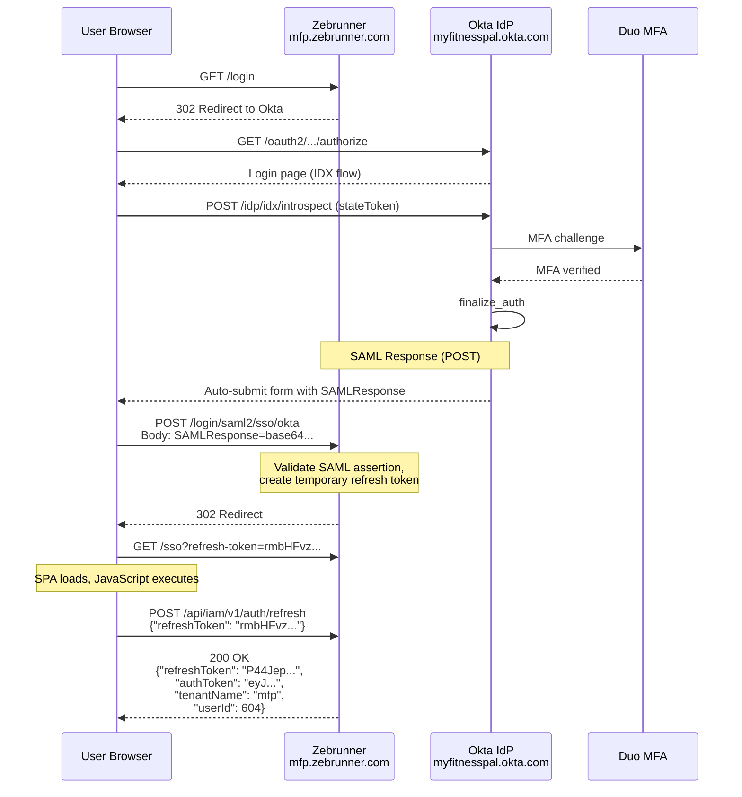
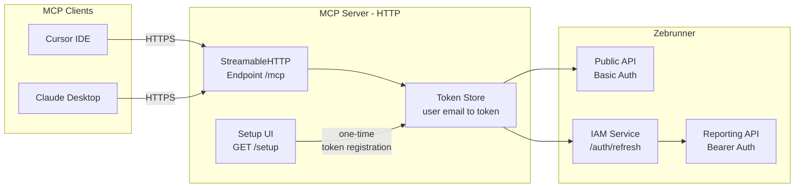
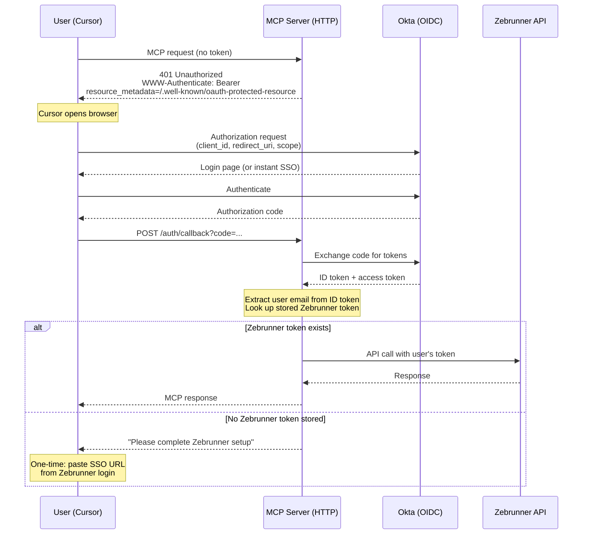
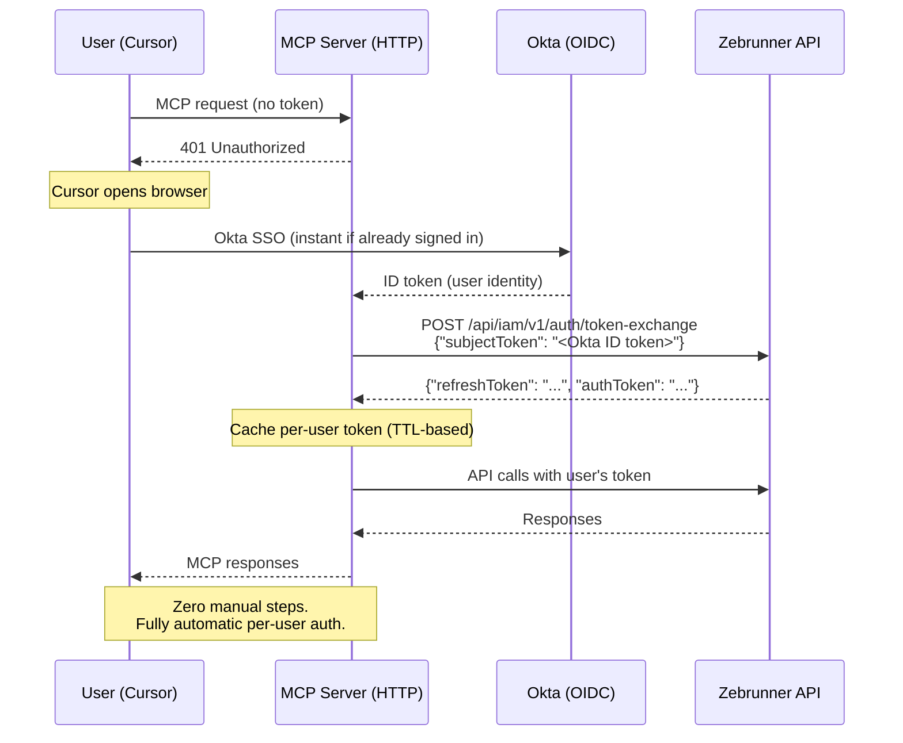

# Enterprise SSO Integration for Zebrunner MCP

## Executive Summary

This document details the investigation and implementation roadmap for integrating Zebrunner MCP with enterprise Single Sign-On (Okta) to enable **per-user authentication** for MCP clients (Cursor, Claude Desktop, Docker MCP Toolkit).

### Key Discovery

During hands-on investigation of the Zebrunner SAML SSO flow, we discovered that the **`refreshToken` issued during SSO login is functionally identical to a Personal API Token**. Both are accepted by the same IAM endpoint (`POST /api/iam/v1/auth/refresh`) and return the same session structure. This eliminates the previously assumed gap between browser-based SAML auth and programmatic API auth.

### Roadmap Overview

| Phase | What | Dependencies | User Experience | Timeline |
|-------|------|-------------|-----------------|----------|
| **Phase 1** | StreamableHTTP transport + per-user token store | None (internal only) | One-time URL paste, then zero-config | 1-2 weeks |
| **Phase 2** | Okta OIDC integration for auto-identification | Okta administrator | Click to authorize, one-time token link | 2-4 weeks |
| **Phase 3** | Zebrunner token exchange endpoint | Zebrunner product team | Fully automatic SSO, zero manual steps | Depends on Zebrunner |

---

## Investigation Findings

### Zebrunner Authentication Methods (Resolved)

| Method | Supported | Details |
|--------|-----------|---------|
| **API Token** | Yes | Personal token from Settings > API Tokens; used as HTTP Basic password |
| **SAML 2.0** | Yes | SP-initiated flow via Okta; ACS URL: `/login/saml2/sso/okta` |
| **OAuth 2.0** | No | Zebrunner does not expose a standalone OAuth 2.0 API. However, the IAM refresh endpoint serves a similar role (see below) |

### Complete SAML SSO Flow (Mapped via DevTools)

The following flow was captured during a live SSO login through Okta with Duo MFA:



### Token Architecture

Three distinct tokens participate in the authentication flow:

| Token | Format | Lifetime | Source | Purpose |
|-------|--------|----------|--------|---------|
| **SSO temp token** | Opaque string (`rmbHFvz...`) | Single use | SAML callback redirect URL | Bridge between SAML and Zebrunner IAM |
| **refreshToken** | Opaque string (`P44Jep...`) | Long-lived (days/weeks) | `/api/iam/v1/auth/refresh` response | Long-term credential; equivalent to Personal API Token |
| **authToken** | JWT (EdDSA, kid: `2024-03`) | 1 hour (`expiresIn: 3600`) | `/api/iam/v1/auth/refresh` response | Short-lived bearer token for API calls |

The **authToken** JWT contains these claims:

| Claim | Example Value | Meaning |
|-------|---------------|---------|
| `tnt` | `mfp` | Tenant name (workspace identifier) |
| `unm` | `maksim.sarychau` | Username |
| `sub` | `604` | User ID |
| `ptp` | `USER` | Principal type |
| `pms` | `["projects:read", ...]` | Permissions array |
| `pass` | `[{"pid":8,"r":"A"}, ...]` | Project assignments with roles |
| `exp` | Unix timestamp | Expiration (1 hour from issuance) |
| `sid` | UUID | Session ID |

### Critical Discovery: Token Interchangeability

The `refreshToken` returned by the SSO flow (`P44Jep...`) was tested directly as `ZEBRUNNER_TOKEN` in the MCP server's `.env` configuration. **It worked identically to a manually-created Personal API Token.** Both token types:

1. Are accepted by `POST /api/iam/v1/auth/refresh` to obtain a Bearer JWT
2. Work as the HTTP Basic auth password for the Public API (`Authorization: Basic base64(login:token)`)
3. Return the same response structure with full user permissions

This means the gap identified in the original investigation ("SAML is browser-based, MCP needs programmatic access") can be bridged by capturing the `refreshToken` from the SSO flow.

### How the MCP Server Currently Uses These Tokens

The MCP server uses `ZEBRUNNER_TOKEN` in two ways simultaneously:

**1. Public TCM API (Basic Auth)**

As implemented in `src/api/enhanced-client.ts`:

```typescript
const basic = Buffer.from(`${config.username}:${config.token}`, "utf8").toString("base64");
this.http = axios.create({
  headers: { Authorization: `Basic ${basic}` }
});
```

**2. Reporting API (Bearer Auth via IAM Refresh)**

As implemented in `src/api/reporting-client.ts`:

```typescript
const response = await this.http.post('/api/iam/v1/auth/refresh', {
  refreshToken: this.config.accessToken  // Same ZEBRUNNER_TOKEN
});
this.bearerToken = response.data.authToken;
// Subsequent calls use: Authorization: Bearer ${bearerToken}
```

The reporting client's base URL strips `/api/public/v1` from `ZEBRUNNER_URL`, so IAM calls go to the instance root.

---

## Current Architecture

### Transport and Configuration

The MCP server currently uses **STDIO transport** exclusively. The MCP client (Cursor, Claude Desktop) spawns a local process and communicates via stdin/stdout.

```
src/server.ts:
  import { StdioServerTransport } from "@modelcontextprotocol/sdk/server/stdio.js";
  const transport = new StdioServerTransport();
  await server.connect(transport);
```

Configuration is loaded by `ConfigManager` from environment variables. Three variables are required:

| Variable | Purpose | Example |
|----------|---------|---------|
| `ZEBRUNNER_URL` | Public API base URL | `https://mfp.zebrunner.com/api/public/v1` |
| `ZEBRUNNER_LOGIN` | Username (email) | `maksim.sarychau` |
| `ZEBRUNNER_TOKEN` | Personal API token or refreshToken from SSO | `P44Jep6i...` |

### Limitations of Current Architecture

| Limitation | Impact |
|-----------|--------|
| Credentials in local `.env` or MCP client config | Users must manually obtain and paste 3 values |
| STDIO transport = local only | Cannot share a single server across users |
| Single set of credentials per instance | No per-user identity when shared as service account |
| No OAuth support | Cannot leverage enterprise SSO for MCP auth |
| MCP OAuth spec requires HTTP transport | Blocked by STDIO architecture |

### SDK Capabilities

The installed SDK (`@modelcontextprotocol/sdk ^1.0.0`, resolved to **1.28.0** in lockfile) already includes HTTP transport, Express integration, and a full OAuth authorization server framework — none of which are currently utilized:

| Module | Import Path | Status |
|--------|-------------|--------|
| `StdioServerTransport` | `server/stdio.js` | In use |
| `SSEServerTransport` | `server/sse.js` | Available (deprecated) |
| `StreamableHTTPServerTransport` | `server/streamableHttp.js` | Available (recommended for HTTP) |
| `createMcpExpressApp` | `server/express.js` | Available (Express app factory with DNS rebinding protection) |
| `mcpAuthRouter` | `server/auth/router.js` | Available (full OAuth 2.1 authorization server) |
| `mcpAuthMetadataRouter` | `server/auth/router.js` | Available (Protected Resource Metadata for resource-server-only mode) |
| `OAuthServerProvider` | `server/auth/provider.js` | Available (interface to implement custom OAuth logic) |

The built-in auth router provides authorization endpoints, dynamic client registration, token issuance/revocation, and metadata discovery out of the box. This significantly reduces the implementation effort for Phases 1 and 2.

---

## Phase 1: StreamableHTTP + Per-User Token Store

**Dependencies:** None (internal implementation only; Express 5 is already bundled with the MCP SDK)
**Effort:** 1-2 weeks
**Enables:** Remote deployment, per-user credentials, single-URL client config

### Architecture



### What Changes

**1. Dual transport support in `src/server.ts`**

Add HTTP transport alongside STDIO, selected by environment variable. The SDK provides `createMcpExpressApp()` for Express integration and `StreamableHTTPServerTransport` for per-request transport handling:

```typescript
import { randomUUID } from 'crypto';
import { StreamableHTTPServerTransport } from "@modelcontextprotocol/sdk/server/streamableHttp.js";
import { createMcpExpressApp } from "@modelcontextprotocol/sdk/server/express.js";

if (process.env.MCP_TRANSPORT === 'http') {
  const app = createMcpExpressApp();

  const transport = new StreamableHTTPServerTransport({
    sessionIdGenerator: () => randomUUID(),
  });

  await server.connect(transport);

  app.all('/mcp', async (req, res) => {
    await transport.handleRequest(req, res, req.body);
  });

  const port = parseInt(process.env.PORT || '3000');
  app.listen(port, () => {
    console.error(`MCP server listening on http://localhost:${port}/mcp`);
  });
} else {
  const transport = new StdioServerTransport();
  await server.connect(transport);
}
```

Existing STDIO users see no change. HTTP mode is opt-in. The SDK's `createMcpExpressApp()` provides DNS rebinding protection by default.

**2. New module: `src/auth/token-store.ts`**

```typescript
interface TokenStore {
  setToken(userId: string, zebrunnerToken: string, metadata?: TokenMetadata): Promise<void>;
  getToken(userId: string): Promise<string | null>;
  deleteToken(userId: string): Promise<void>;
  listUsers(): Promise<string[]>;
}

interface TokenMetadata {
  tenantName: string;
  username: string;
  registeredAt: string;
  lastUsedAt?: string;
}
```

Initial implementation: encrypted JSON file. Production upgrade path: AWS Secrets Manager, HashiCorp Vault, or database.

**3. Per-request user token lookup**

```typescript
async function handleToolCall(request: MCPRequest) {
  const userId = request.context?.userId;
  const zebrunnerToken = await tokenStore.getToken(userId);

  const client = new EnhancedZebrunnerClient({
    baseUrl: ZEBRUNNER_URL,
    username: userId,
    token: zebrunnerToken,
  });

  return await executeTool(client, request);
}
```

**4. Setup UI at `/setup`**

A minimal web page where users register their Zebrunner token:

1. User opens `https://mcp-server/setup`
2. Page instructs: "Log in to Zebrunner, then paste the URL from your address bar"
3. After SSO login, the address bar shows: `https://mfp.zebrunner.com/sso?refresh-token=TOKEN`
4. User pastes this URL into the setup form
5. Server extracts `refresh-token` from the URL, calls `/api/iam/v1/auth/refresh` to validate and get user identity
6. Stores the token keyed by the `unm` (username) claim from the JWT response

### Client Configuration

STDIO (unchanged, backward compatible):
```json
{
  "mcpServers": {
    "zebrunner": {
      "command": "npx",
      "args": ["-y", "mcp-zebrunner"],
      "env": {
        "ZEBRUNNER_URL": "https://mfp.zebrunner.com/api/public/v1",
        "ZEBRUNNER_LOGIN": "your.email@company.com",
        "ZEBRUNNER_TOKEN": "your_api_token_here"
      }
    }
  }
}
```

StreamableHTTP (new):
```json
{
  "mcpServers": {
    "zebrunner": {
      "url": "https://mcp.company.internal/mcp"
    }
  }
}
```

One line. No credentials in client config.

### Deployment

Docker Compose example:

```yaml
services:
  mcp-zebrunner:
    image: msarychau/mcp-zebrunner:latest
    environment:
      MCP_TRANSPORT: http
      PORT: 3000
      ZEBRUNNER_URL: https://mfp.zebrunner.com/api/public/v1
      TOKEN_STORE_PATH: /data/tokens.enc
      TOKEN_STORE_KEY: ${ENCRYPTION_KEY}
    ports:
      - "3000:3000"
    volumes:
      - token-data:/data
    read_only: true

volumes:
  token-data:
```

Network access should be restricted to VPN or internal network for Phase 1 (no OAuth yet).

---

## Phase 2: Okta OIDC Integration

**Dependencies:** Okta administrator creates an OIDC application
**Effort:** 2-4 weeks (including approval process)
**Enables:** Automatic user identification via SSO, eliminates manual email entry during setup

### Why This Phase Matters

#### Security Benefits

| Current Risk (Phase 1) | Mitigated by Phase 2 |
|------------------------|---------------------|
| Setup page has no authentication; anyone on the network can register tokens | Only Okta-authenticated corporate users can access the MCP server |
| No verification that the user registering a token is who they claim to be | User identity verified by corporate IdP |
| Token registration is self-service with no audit trail | Okta logs all authentication events |
| Revoking access requires manually deleting tokens | Disabling user in Okta immediately revokes MCP access |

#### Business Benefits

- **Compliance**: Per-user audit trail for all MCP operations; traceable to corporate identity
- **Onboarding**: New employees connect to MCP by clicking one link (Okta SSO is instant if already signed in)
- **Offboarding**: Disabling an employee in Okta automatically revokes their MCP access
- **Consistency**: Same login experience as all other corporate tools
- **Visibility**: IT can see which users are using MCP and how often

### Architecture



### How to Get Approval from IT/Okta Admin

#### Step 1: Prepare the Request

Send the following to your IT/Security team or Okta administrator:

---

**Subject: Request to Create OIDC Application for Zebrunner MCP Server**

**What:** Create a new OIDC (OpenID Connect) Web Application in Okta for the Zebrunner MCP integration server.

**Why:** The QA team uses an AI-powered MCP (Model Context Protocol) server to interact with Zebrunner test management. Currently, each user must manually configure API credentials. Adding Okta OIDC authentication will:

- Enable per-user access control through existing Okta groups and policies
- Provide audit trail for all AI-assisted test management operations
- Allow centralized access revocation (offboarding)
- Align with corporate SSO standards
- Eliminate shared service account credentials

**Security posture:**
- The MCP server is deployed internally (VPN/internal network only)
- No sensitive data is stored in the MCP server itself; it proxies requests to Zebrunner
- Okta tokens are validated server-side and never exposed to end users
- PKCE (Proof Key for Code Exchange) is used for all authorization flows

**Technical requirements:**
- Application type: Web Application
- Grant type: Authorization Code with PKCE
- Redirect URIs: `https://mcp.company.internal/auth/callback`, `http://localhost:3000/auth/callback` (for development)
- Scopes: `openid`, `email`, `profile`
- User assignment: Same users/groups that have access to Zebrunner

**Requested information (after creation):**
- Client ID
- Client Secret (or confirm public client with PKCE-only)
- Okta domain (e.g., `myfitnesspal.okta.com`)
- Authorization server ID (e.g., `default`)

---

#### Step 2: Okta Admin Configuration Steps

Once approved, the Okta admin performs these steps:

1. **Okta Admin Console** > Applications > Create App Integration
2. Select **OIDC - OpenID Connect** > **Web Application**
3. Configure:
   - App name: `Zebrunner MCP Server`
   - Logo: (optional, Zebrunner logo)
   - Sign-in redirect URIs: `https://mcp.company.internal/auth/callback`
   - Sign-out redirect URIs: `https://mcp.company.internal`
   - Controlled access: Limit to groups that use Zebrunner
4. Note the **Client ID** and **Client Secret**
5. Under **Okta API Scopes**, ensure `openid`, `email`, `profile` are granted

#### Step 3: MCP Server Configuration

After receiving Okta credentials, configure the MCP server:

```env
# Okta OIDC Configuration (Phase 2)
OKTA_DOMAIN=myfitnesspal.okta.com
OKTA_CLIENT_ID=0oa...
OKTA_CLIENT_SECRET=...
OKTA_AUTH_SERVER_ID=default
MCP_SERVER_URL=https://mcp.company.internal
```

### Technical Implementation

**New dependencies:**
- `@okta/jwt-verifier` — validate Okta tokens server-side
- Express 5 and `jose` (JWT library) are already bundled with the MCP SDK — no additional install required

**SDK built-in auth support:**

The MCP SDK 1.28.0 provides a complete OAuth authorization server framework. Instead of building custom OAuth middleware, we implement the `OAuthServerProvider` interface and plug it into the SDK's `mcpAuthRouter`:

```typescript
import { mcpAuthRouter } from "@modelcontextprotocol/sdk/server/auth/router.js";
import type { OAuthServerProvider } from "@modelcontextprotocol/sdk/server/auth/provider.js";

// Implement the OAuthServerProvider interface with Okta as the backing IdP
const oktaProvider: OAuthServerProvider = {
  get clientsStore() { return registeredClientsStore; },

  async authorize(client, params, res) {
    // Redirect to Okta for authentication
    const oktaAuthUrl = `https://${OKTA_DOMAIN}/oauth2/${OKTA_AUTH_SERVER_ID}/v1/authorize`;
    res.redirect(`${oktaAuthUrl}?client_id=${OKTA_CLIENT_ID}&...`);
  },

  async exchangeAuthorizationCode(client, code, codeVerifier, redirectUri, resource) {
    // Exchange code at Okta, then look up Zebrunner token for this user
    const oktaTokens = await exchangeCodeAtOkta(code, codeVerifier, redirectUri);
    return { access_token: oktaTokens.access_token, token_type: 'bearer' };
  },

  async verifyAccessToken(token) {
    // Validate Okta access token, return user identity
    const jwt = await oktaVerifier.verifyAccessToken(token, 'api://default');
    return { token, clientId: '...', scopes: [...], extra: { email: jwt.claims.email } };
  },
  // ... other required methods
};

// Mount the auth router — provides all OAuth endpoints automatically:
// - GET /.well-known/oauth-authorization-server
// - GET /.well-known/oauth-protected-resource
// - GET /authorize
// - POST /token
// - POST /register (dynamic client registration)
// - POST /revoke (token revocation)
app.use(mcpAuthRouter({
  provider: oktaProvider,
  issuerUrl: new URL(MCP_SERVER_URL),
  scopesSupported: ['zebrunner:read', 'zebrunner:write'],
}));
```

**New module: `src/auth/okta-provider.ts`**

Implements `OAuthServerProvider` with Okta as the backing identity provider:

```typescript
import OktaJwtVerifier from '@okta/jwt-verifier';

const oktaVerifier = new OktaJwtVerifier({
  issuer: `https://${OKTA_DOMAIN}/oauth2/${OKTA_AUTH_SERVER_ID}`,
  clientId: OKTA_CLIENT_ID,
});

export async function validateOktaToken(accessToken: string): Promise<UserIdentity> {
  const jwt = await oktaVerifier.verifyAccessToken(accessToken, 'api://default');
  return {
    email: jwt.claims.email,
    name: jwt.claims.name,
    sub: jwt.claims.sub,
  };
}
```

**What the SDK handles automatically:**

The `mcpAuthRouter` provides these endpoints out of the box, eliminating the need for custom implementation:

| Endpoint | Purpose |
|----------|---------|
| `GET /.well-known/oauth-authorization-server` | Authorization server metadata discovery |
| `GET /.well-known/oauth-protected-resource` | Protected Resource Metadata (RFC 9728) |
| `GET /authorize` | Authorization endpoint (redirects to Okta) |
| `POST /token` | Token endpoint (code exchange, refresh) |
| `POST /register` | Dynamic client registration (RFC 7591) |
| `POST /revoke` | Token revocation |

**MCP Protocol compliance:**

The SDK's auth router implements the [MCP Authorization Specification (2025-11-25)](https://modelcontextprotocol.io/specification/2025-11-25/basic/authorization) natively:

- Protected Resource Metadata at `/.well-known/oauth-protected-resource` per [RFC 9728](https://datatracker.ietf.org/doc/html/rfc9728)
- Authorization server discovery via `/.well-known/oauth-authorization-server` per [RFC 8414](https://datatracker.ietf.org/doc/html/rfc8414)
- PKCE required for all authorization flows
- Bearer token in `Authorization` header for all MCP requests
- Dynamic client registration for MCP clients per [RFC 7591](https://datatracker.ietf.org/doc/html/rfc7591)

---

## Phase 3: Zebrunner Token Exchange Endpoint

**Dependencies:** Zebrunner product team implements a new API endpoint
**Effort:** Variable (depends on Zebrunner team prioritization)
**Enables:** Fully automatic per-user SSO with zero manual steps

### Why This Phase Matters

Phase 3 eliminates the **last remaining manual step**: users no longer need to log into Zebrunner separately to capture their `refreshToken`. The MCP server handles the entire credential flow automatically.

#### Business Impact

| Without Phase 3 | With Phase 3 |
|-----------------|-------------|
| Each user must do a one-time Zebrunner login + URL paste to register their token | Users click "Authorize" once (Okta SSO) and everything works |
| IT must document the token registration process | Zero documentation needed for end users |
| Support tickets: "How do I get my API token?" | No support tickets related to MCP auth |
| Only MCP benefits from the integration | CI/CD pipelines, CLI tools, and other integrations can use the same endpoint |
| Token registration is a barrier to adoption | Frictionless onboarding drives adoption |

#### Strategic Value for Zebrunner

The token exchange endpoint is not just about MCP. It is a **general-purpose API** that enables any system authenticated via Okta (or any OIDC provider) to obtain Zebrunner credentials programmatically. This unblocks:

- **CI/CD integration**: GitHub Actions, Jenkins, and other pipelines can authenticate using their own OIDC tokens (e.g., GitHub's `OIDC` token for AWS) to get Zebrunner tokens without storing long-lived secrets
- **CLI tools**: A `zebrunner-cli login` command that opens a browser, authenticates via SSO, and gets a token — similar to `gh auth login` or `aws sso login`
- **Third-party integrations**: Any tool that supports OIDC can integrate with Zebrunner without manual token provisioning

### What Zebrunner Needs to Add

A single new endpoint that mirrors the logic already performed internally during SAML login (`/login/saml2/sso/okta` already validates an external identity assertion and issues a `refreshToken`):

#### Proposed API Specification

```
POST /api/iam/v1/auth/token-exchange
Content-Type: application/json

Request:
{
  "subjectToken": "<Okta ID Token JWT>",
  "subjectTokenType": "urn:ietf:params:oauth:token-type:id_token",
  "grantType": "urn:ietf:params:oauth:grant-type:token-exchange"
}

Response (200 OK):
{
  "tenantName": "mfp",
  "authToken": "eyJ...",
  "authTokenType": "Bearer",
  "refreshToken": "P44Jep...",
  "userId": 604,
  "permissionsSuperset": ["projects:read", ...],
  "projectAssignments": [{"projectId": 8, "role": "ADMINISTRATOR"}, ...]
}

Error (401):
{
  "error": "invalid_token",
  "message": "The provided ID token is not from a trusted issuer"
}
```

#### Implementation Notes for Zebrunner Team

1. **Validate the Okta ID token**: Verify JWT signature against Okta's JWKS endpoint (`https://<okta-domain>/oauth2/<server-id>/v1/keys`), check `iss`, `aud`, `exp` claims
2. **Map user identity**: Match the `email` claim from the ID token to an existing Zebrunner user. If the user logged in via SAML before, their email already exists in Zebrunner's user database
3. **Issue tokens**: Use the same internal token-issuance logic that `/login/saml2/sso/okta` uses after SAML validation
4. **Trust configuration**: Require administrators to configure trusted OIDC issuers (Okta domain + client IDs) in Zebrunner's SSO settings

This follows the [OAuth 2.0 Token Exchange standard (RFC 8693)](https://datatracker.ietf.org/doc/html/rfc8693).

### How to Get Approval from Zebrunner Team

#### Step 1: Submit Feature Request

---

**Title: API Endpoint for OAuth Token Exchange (OIDC to Zebrunner)**

**Category:** Authentication / API

**Problem:**
Enterprise customers using Zebrunner with Okta SSO cannot programmatically obtain API tokens. The current workflow requires:
1. User logs into Zebrunner via browser (SAML SSO)
2. User navigates to Settings > API Tokens
3. User manually creates and copies a token
4. User pastes it into their integration tool's configuration

This creates friction for:
- MCP (Model Context Protocol) server integration, where each user needs per-user credentials
- CI/CD pipelines that need Zebrunner tokens without storing long-lived secrets
- CLI tools that want `gh auth login`-style SSO authentication
- Any automated system that needs user-scoped Zebrunner access

**Proposed solution:**
Add `POST /api/iam/v1/auth/token-exchange` that accepts an OIDC ID token (from a trusted issuer like Okta) and returns Zebrunner credentials. This is the same token-issuance logic that `/login/saml2/sso/okta` performs after SAML validation, exposed as a JSON API instead of a browser redirect.

**Technical precedent:**
- Zebrunner already does identity-to-token exchange internally during SAML login
- This pattern is standard: GitHub ([token exchange](https://docs.github.com/en/actions/security-for-github-actions/security-hardening-your-deployments/about-security-hardening-with-openid-connect)), GitLab ([ID token auth](https://docs.gitlab.com/ee/ci/secrets/id_token_authentication.html)), AWS ([STS AssumeRoleWithWebIdentity](https://docs.aws.amazon.com/STS/latest/APIReference/API_AssumeRoleWithWebIdentity.html))
- Follows OAuth 2.0 Token Exchange (RFC 8693)

**Impact:**
- Unblocks enterprise MCP adoption with per-user auth
- Enables secure CI/CD integration without long-lived secrets
- Reduces support burden for token provisioning

---

### End-to-End Flow with Phase 3



### Technical Implementation (MCP Server Side)

Once Zebrunner provides the endpoint, the MCP server changes are minimal:

```typescript
// In src/auth/token-exchange.ts
export async function exchangeOktaTokenForZebrunner(
  oktaIdToken: string,
  zebrunnerBaseUrl: string
): Promise<ZebrunnerCredentials> {
  const response = await axios.post(
    `${zebrunnerBaseUrl}/api/iam/v1/auth/token-exchange`,
    {
      subjectToken: oktaIdToken,
      subjectTokenType: 'urn:ietf:params:oauth:token-type:id_token',
      grantType: 'urn:ietf:params:oauth:grant-type:token-exchange'
    }
  );

  return {
    refreshToken: response.data.refreshToken,
    authToken: response.data.authToken,
    tenantName: response.data.tenantName,
    username: decodeJwt(response.data.authToken).unm,
  };
}
```

The token store from Phase 1 becomes a **cache** rather than permanent storage. Tokens are obtained automatically and refreshed when expired.

---

## Comparison Matrix

| Aspect | Current (STDIO) | Phase 1 (HTTP + Token Store) | Phase 2 (+ Okta OIDC) | Phase 3 (+ Token Exchange) |
|--------|-----------------|------------------------------|------------------------|---------------------------|
| **Transport** | STDIO (local) | StreamableHTTP (remote) | StreamableHTTP (remote) | StreamableHTTP (remote) |
| **User setup steps** | 6 manual steps | 1 URL paste | 1 click + 1 URL paste | 1 click (or zero) |
| **Per-user audit** | No (shared token) | Yes | Yes | Yes |
| **User identification** | None | Self-reported | Okta-verified | Okta-verified |
| **Token provisioning** | Manual from Zebrunner UI | Manual from SSO URL | Manual from SSO URL | Fully automatic |
| **Access revocation** | Delete .env | Remove from token store | Disable in Okta + remove token | Disable in Okta (instant) |
| **Infrastructure** | None | HTTP server + token file | + Okta OIDC app | + Zebrunner endpoint |
| **Client config** | 3 env vars | 1 URL | 1 URL | 1 URL |
| **External dependencies** | None | None | Okta admin | Zebrunner product team |
| **MCP spec compliance** | N/A (STDIO) | Partial | Full OAuth | Full OAuth |
| **Supports CI/CD** | Via env vars only | Via token store API | Via client credentials | Via OIDC token exchange |
| **Best for** | Single developer | Small team, internal | Medium team, enterprise | Large enterprise, full SSO |

---

## MCP Protocol Auth Specification Reference

The MCP protocol defines authorization capabilities at the transport level. These specifications informed the phased roadmap above.

### Core Authorization (StreamableHTTP)

**Spec:** [MCP Authorization (2025-11-25)](https://modelcontextprotocol.io/specification/2025-11-25/basic/authorization)

- Applies to HTTP-based transports only; STDIO should use environment credentials
- Based on OAuth 2.1 (draft-ietf-oauth-v2-1-13)
- MCP servers act as OAuth 2.0 Resource Servers
- MCP clients act as OAuth 2.0 Clients
- Protected Resource Metadata via RFC 9728 (`.well-known/oauth-protected-resource`)
- PKCE required for all authorization code flows
- Phase 1 and Phase 2 implement subsets of this specification

### Enterprise-Managed Authorization Extension

**Spec:** [Enterprise-Managed Authorization](https://modelcontextprotocol.io/extensions/auth/enterprise-managed-authorization)

Extension ID: `io.modelcontextprotocol/enterprise-managed-authorization`

- Designed for organizations with centralized IdPs (Okta, Azure AD)
- Uses Identity Assertion JWT Authorization Grant (ID-JAG)
- Employees authenticate via corporate SSO, IdP controls MCP server access
- Phase 3 aligns with this extension's model

### OAuth Client Credentials Extension

**Spec:** [OAuth Client Credentials](https://modelcontextprotocol.io/extensions/auth/oauth-client-credentials)

Extension ID: `io.modelcontextprotocol/oauth-client-credentials`

- Machine-to-machine authentication without user interaction
- Useful for CI/CD pipelines and background services
- Supports JWT Bearer Assertions (RFC 7523) and client secrets
- Can be implemented alongside Phase 2 for automated systems

### Mapping Phases to MCP Auth Specs

| MCP Auth Feature | Phase 1 | Phase 2 | Phase 3 |
|-----------------|---------|---------|---------|
| StreamableHTTP transport | Yes | Yes | Yes |
| Protected Resource Metadata (RFC 9728) | No | Yes | Yes |
| OAuth Authorization Code + PKCE | No | Yes | Yes |
| Enterprise-Managed Authorization | No | Partial | Full |
| Client Credentials (for CI/CD) | No | Can add | Can add |
| Token audience binding (RFC 8707) | No | Yes | Yes |

---

## Docker MCP Gateway Integration

The Docker MCP Toolkit provides an alternative deployment path with built-in OAuth support.

### Current Docker Configuration

Docker deployment uses the same STDIO transport with environment-variable credentials:

```yaml
# custom-catalog.yaml (current, simplified)
servers:
  zebrunner-mcp:
    name: "Zebrunner MCP"
    version: "7.1.1"
    image: "msarychau/mcp-zebrunner:latest"
    transport: "stdio"
    env:
      ZEBRUNNER_URL:
        description: "Base URL of your Zebrunner instance"
        required: true
      ZEBRUNNER_LOGIN:
        description: "Your Zebrunner username or email"
        required: true
      ZEBRUNNER_TOKEN:
        description: "Personal access token (Settings → API Tokens) or refreshToken from SSO session"
        required: true
        secret: true
```

### Docker + StreamableHTTP (Phase 1)

With HTTP transport, Docker deployment becomes a standard web service:

```yaml
services:
  mcp-zebrunner:
    image: msarychau/mcp-zebrunner:latest
    environment:
      MCP_TRANSPORT: http
      PORT: 3000
      ZEBRUNNER_URL: https://mfp.zebrunner.com/api/public/v1
    ports:
      - "3000:3000"
```

### Docker MCP Gateway OAuth (Phase 2+)

The Docker MCP Gateway supports OAuth provider configuration:

```yaml
providers:
  okta:
    display_name: "Zebrunner via Okta"
    client_id: "${OKTA_CLIENT_ID}"
    client_secret: "${OKTA_CLIENT_SECRET}"
    auth_url: "https://myfitnesspal.okta.com/oauth2/default/v1/authorize"
    token_url: "https://myfitnesspal.okta.com/oauth2/default/v1/token"
    user_info_url: "https://myfitnesspal.okta.com/oauth2/default/v1/userinfo"
    scopes: ["openid", "email", "profile"]
    enabled: true
```

Docker Desktop users would authenticate via:

```bash
docker mcp server enable mcp-zebrunner
docker mcp oauth authorize mcp-zebrunner  # Opens browser for Okta SSO
```

---

## Resolved Questions

The original investigation had four open questions. All are now answered:

| Original Question | Answer |
|-------------------|--------|
| **Does Zebrunner support OAuth 2.0 for API access?** | No standalone OAuth 2.0 API exists. However, the IAM refresh endpoint (`/api/iam/v1/auth/refresh`) accepts opaque refresh tokens and returns Bearer JWTs, which serves a similar purpose. |
| **Can API tokens be generated programmatically after SAML login?** | Yes. The SSO flow redirects to `/sso?refresh-token=TOKEN`, and this token is functionally identical to a Personal API Token. It can be captured from the redirect URL without any additional API calls. |
| **What's the API token lifecycle?** | The `refreshToken` is long-lived (exact TTL to be confirmed; survived multi-day testing). The `authToken` (JWT) expires after 1 hour (`expiresIn: 3600`). The reporting client automatically refreshes the JWT when expired. |
| **Enterprise Claude Desktop OAuth requirements?** | MCP clients (Cursor, Claude Desktop) support OAuth 2.0 for HTTP-based MCP servers via the [MCP Authorization spec](https://modelcontextprotocol.io/specification/2025-11-25/basic/authorization). This requires StreamableHTTP transport (not STDIO). |

## Remaining Open Questions

1. **Exact refreshToken TTL**: How long does the `refreshToken` from SSO remain valid? If Zebrunner implements token rotation (issuing a new `refreshToken` on each `/auth/refresh` call), how does this affect stored tokens?

2. **Token rotation behavior**: When `/api/iam/v1/auth/refresh` is called, does the original `refreshToken` get invalidated? The response includes a new `refreshToken` — is the old one still valid?

3. **Zebrunner plans for OAuth/OIDC API**: Does the Zebrunner team have a roadmap for adding OAuth 2.0 or OIDC token exchange? This would accelerate Phase 3.

4. **MCP client SSE/StreamableHTTP adoption**: Which MCP clients (Cursor, Claude Desktop, Windsurf, etc.) currently support HTTP transport with OAuth? This affects Phase 2 rollout timing.

5. **Okta application approval timeline**: What is the typical turnaround time for creating a new OIDC app in the organization's Okta tenant?

---

## References

### Zebrunner
- [Zebrunner SSO Documentation](https://zebrunner.com/documentation/guide/sso/)
- Zebrunner IAM API: `POST /api/iam/v1/auth/refresh` (token exchange)
- Zebrunner SAML ACS: `POST /login/saml2/sso/okta` (SAML callback)

### MCP Protocol
- [MCP Authorization Specification (2025-11-25)](https://modelcontextprotocol.io/specification/2025-11-25/basic/authorization)
- [MCP Enterprise-Managed Authorization Extension](https://modelcontextprotocol.io/extensions/auth/enterprise-managed-authorization)
- [MCP OAuth Client Credentials Extension](https://modelcontextprotocol.io/extensions/auth/oauth-client-credentials)
- [MCP Auth Extensions Repository](https://github.com/modelcontextprotocol/ext-auth)
- [MCP Security Best Practices](https://modelcontextprotocol.io/specification/2025-11-25/basic/security_best_practices)

### OAuth Standards
- [RFC 8693 — OAuth 2.0 Token Exchange](https://datatracker.ietf.org/doc/html/rfc8693)
- [RFC 9728 — OAuth 2.0 Protected Resource Metadata](https://datatracker.ietf.org/doc/html/rfc9728)
- [RFC 8414 — OAuth 2.0 Authorization Server Metadata](https://datatracker.ietf.org/doc/html/rfc8414)
- [OAuth 2.1 Draft](https://datatracker.ietf.org/doc/html/draft-ietf-oauth-v2-1-13)

### Okta
- [Okta OAuth 2.0 / OIDC Guide](https://developer.okta.com/docs/guides/)
- [Okta JWT Verifier (Node.js)](https://github.com/okta/okta-jwt-verifier-js)

### Docker MCP
- [Docker MCP Toolkit](https://docs.docker.com/ai/mcp-catalog-and-toolkit/toolkit/)
- [Docker MCP Registry](https://github.com/docker/mcp-registry)
- [Docker MCP Gateway Docs](https://github.com/docker/mcp-gateway/tree/main/docs)
- [MCP OAuth Gateway (third-party)](https://github.com/akshay5995/mcp-oauth-gateway)

### Source Code References
- `src/server.ts` — MCP server bootstrap, transport, client initialization
- `src/api/enhanced-client.ts` — Public API client (Basic auth)
- `src/api/reporting-client.ts` — Reporting API client (Bearer auth via IAM refresh)
- `src/config/defaults.ts` — Required environment variables and defaults
- `server.json` — MCP server registry schema
- `custom-catalog.yaml` / `mcp-catalog.yaml` — Docker deployment catalogs

---

*Last Updated: April 2026*
