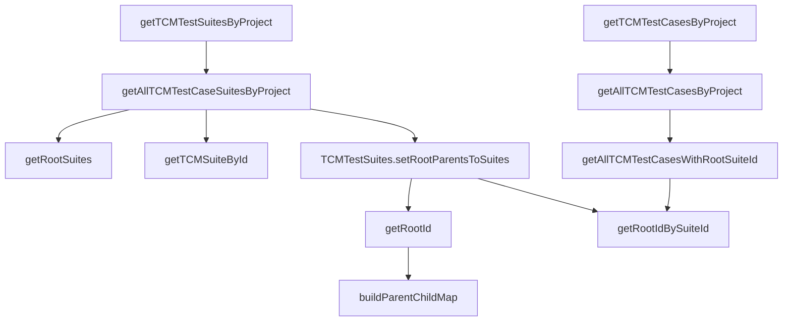

# Zebrunner MCP API Implementation Guide

## Deep Analysis & TypeScript Implementation Steps

This document provides detailed steps for implementing the core Zebrunner API functions in TypeScript for the MCP Server, based on deep analysis of the Java implementation.

## 🔍 Java Logic Analysis Summary

### Core Function Dependencies & Flow



### Key Patterns Identified
1. **Pagination Pattern**: All "getAll" methods use pagination with LinkedHashSet for deduplication
2. **Hierarchy Building**: Root suite relationships calculated using parent-child mapping
3. **Data Enrichment**: Test cases are enriched with suite hierarchy information
4. **Error Handling**: HTTP status codes checked, null responses handled
5. **Logging**: Console logging for operation results and debugging

## 🚀 Implementation Steps for Cursor

### Phase 1: Core Infrastructure Setup

#### Step 1.1: Create Base HTTP Client
```typescript
// File: src/api/ZebrunnerHttpClient.ts
import axios, { AxiosInstance, AxiosResponse } from 'axios';

interface ZebrunnerConfig {
  baseUrl: string;
  username: string;
  password: string;
  timeout?: number;
}

export class ZebrunnerHttpClient {
  private client: AxiosInstance;

  constructor(config: ZebrunnerConfig) {
    this.client = axios.create({
      baseURL: config.baseUrl,
      timeout: config.timeout || 30000,
      auth: {
        username: config.username,
        password: config.password
      },
      headers: {
        'Content-Type': 'application/json',
        'Accept': 'application/json'
      }
    });

    // Add request interceptor for logging
    this.client.interceptors.request.use(
      (config) => {
        console.log(`[API Request] ${config.method?.toUpperCase()} ${config.url}`);
        return config;
      },
      (error) => Promise.reject(error)
    );

    // Add response interceptor for error handling
    this.client.interceptors.response.use(
      (response) => response,
      (error) => {
        console.error(`[API Error] ${error.response?.status} ${error.response?.statusText}`);
        console.error(`[API Error Body] ${JSON.stringify(error.response?.data)}`);
        return Promise.reject(error);
      }
    );
  }

  async get<T>(endpoint: string, params?: Record<string, any>): Promise<T | null> {
    try {
      const response: AxiosResponse<T> = await this.client.get(endpoint, { params });
      return response.status === 200 ? response.data : null;
    } catch (error) {
      console.error(`Failed to GET ${endpoint}:`, error);
      return null;
    }
  }
}
```

#### Step 1.2: Define Core TypeScript Interfaces
```typescript
// File: src/types/ZebrunnerTypes.ts
export interface ZebrunnerTestSuite {
  id: number;
  parentSuiteId?: number;
  parentSuiteName?: string;
  rootSuiteId?: number;
  rootSuiteName?: string;
  treeNames?: string;
  relativePosition: number;
  title: string;
  description: string;
}

export interface ZebrunnerTestCase {
  id: number;
  key: string;
  deleted: boolean;
  testSuite: ZebrunnerTestSuite;
  rootSuiteId?: number;
  relativePosition: number;
  createdAt: string;
  lastModifiedAt?: string;
  title: string;
  description?: string;
  deprecated: boolean;
  draft: boolean;
  projKey?: string;
}

export interface ZebrunnerTestSuites {
  items: ZebrunnerTestSuite[];
  _meta?: {
    nextPageToken?: string;
  };
}

export interface ZebrunnerTestCases {
  items: ZebrunnerTestCase[];
  _meta?: {
    nextPageToken?: string;
  };
}

export interface PaginationOptions {
  maxPageSize?: number;
  pageToken?: string;
}
```

### Phase 2: Core API Methods Implementation

#### Step 2.1: getTCMTestSuitesByProject
```typescript
// File: src/api/ZebrunnerApiClient.ts
export class ZebrunnerApiClient {
  private httpClient: ZebrunnerHttpClient;

  constructor(config: ZebrunnerConfig) {
    this.httpClient = new ZebrunnerHttpClient(config);
  }

  /**
   * Retrieves TCM test suites from a project with pagination support
   * Equivalent to: getTCMTestSuitesByProject(String projectKey, int maxPageSize, String pageToken)
   */
  async getTCMTestSuitesByProject(
    projectKey: string,
    maxPageSize: number = 100,
    pageToken?: string
  ): Promise<ZebrunnerTestSuites | null> {
    const params: Record<string, any> = {
      projectKey,
      maxPageSize
    };

    if (pageToken) {
      params.pageToken = pageToken;
    }

    const response = await this.httpClient.get<ZebrunnerTestSuites>('test-suites', params);
    return response;
  }

  /**
   * Overloaded methods for convenience
   */
  async getTCMTestSuitesByProjectSimple(projectKey: string): Promise<ZebrunnerTestSuites | null> {
    return this.getTCMTestSuitesByProject(projectKey, 100, undefined);
  }

  async getTCMTestSuitesByProjectWithPageSize(
    projectKey: string,
    maxPageSize: number
  ): Promise<ZebrunnerTestSuites | null> {
    return this.getTCMTestSuitesByProject(projectKey, maxPageSize, undefined);
  }
}
```

#### Step 2.2: getAllTCMTestCaseSuitesByProject
```typescript
/**
 * Retrieves all TCM test suites using pagination
 * Equivalent to: getAllTCMTestCaseSuitesByProject(String projectKey)
 */
async getAllTCMTestCaseSuitesByProject(projectKey: string): Promise<ZebrunnerTestSuite[]> {
  const allSuites = new Set<ZebrunnerTestSuite>();
  const maxPageSize = 100;

  let response = await this.getTCMTestSuitesByProject(projectKey, maxPageSize, undefined);

  if (!response) {
    console.error('Failed to get initial page of test suites');
    return [];
  }

  // Add first page items
  response.items.forEach(suite => allSuites.add(suite));

  // Continue pagination if there are more pages
  let nextPageToken = response._meta?.nextPageToken;
  while (nextPageToken) {
    response = await this.getTCMTestSuitesByProject(projectKey, maxPageSize, nextPageToken);

    if (!response) {
      console.error('Failed to get paginated test suites');
      break;
    }

    response.items.forEach(suite => allSuites.add(suite));
    nextPageToken = response._meta?.nextPageToken;
  }

  const result = Array.from(allSuites);
  console.log(`Found ${result.length} suites.`);
  return result;
}
```

#### Step 2.3: getRootSuites
```typescript
/**
 * Filters test suites to return only root suites (parentSuiteId === null)
 * Equivalent to: getRootSuites(List<TCMTestSuite> list)
 */
getRootSuites(suites: ZebrunnerTestSuite[]): ZebrunnerTestSuite[] {
  return suites.filter(suite => suite.parentSuiteId === null || suite.parentSuiteId === undefined);
}
```

#### Step 2.4: getTCMSuiteById
```typescript
/**
 * Finds a test suite by ID, optionally filtering to root suites only
 * Equivalent to: getTCMSuiteById(String projKey, int suiteId, boolean onlyRootSuites)
 */
async getTCMSuiteById(
  projectKey: string,
  suiteId: number,
  onlyRootSuites: boolean = true
): Promise<ZebrunnerTestSuite | null> {
  const testSuites = await this.getAllTCMTestCaseSuitesByProject(projectKey);

  let filteredSuites = testSuites;
  if (onlyRootSuites) {
    filteredSuites = this.getRootSuites(testSuites);
  }

  const suite = filteredSuites.find(suite => suite.id === suiteId);

  if (suite) {
    console.log(`Found suite by id ${suiteId} with title: ${suite.title}`);
    console.log(`Item ID: ${suite.id}`);
    console.log(`Parent Suite ID: ${suite.parentSuiteId}`);
    console.log(`Relative Position: ${suite.relativePosition}`);
    console.log(`Title: ${suite.title}`);
    console.log(`Description: ${suite.description}`);
    console.log();
  } else {
    console.log(`Suite id ${suiteId} was not found`);
  }

  return suite || null;
}

/**
 * Overloaded method with default onlyRootSuites = true
 */
async getTCMSuiteByIdSimple(projectKey: string, suiteId: number): Promise<ZebrunnerTestSuite | null> {
  return this.getTCMSuiteById(projectKey, suiteId, true);
}
```

### Phase 3: Test Cases Implementation

#### Step 3.1: getTCMTestCasesByProject (Base Method)
```typescript
/**
 * Base method for retrieving test cases with pagination
 * Equivalent to: getTCMTestCasesByProject(String projectKey, int maxPageSize, String pageToken)
 */
async getTCMTestCasesByProject(
  projectKey: string,
  maxPageSize: number = 100,
  pageToken?: string
): Promise<ZebrunnerTestCases | null> {
  const params: Record<string, any> = {
    projectKey,
    maxPageSize
  };

  if (pageToken) {
    params.pageToken = pageToken;
  }

  const response = await this.httpClient.get<ZebrunnerTestCases>('test-cases', params);
  return response;
}
```

#### Step 3.2: getAllTCMTestCasesByProject
```typescript
/**
 * Retrieves all test cases using pagination with deduplication
 * Equivalent to: getAllTCMTestCasesByProject(String projectKey)
 */
async getAllTCMTestCasesByProject(projectKey: string): Promise<ZebrunnerTestCase[]> {
  const allTestCases = new Set<ZebrunnerTestCase>();
  const maxPageSize = 100;

  let response = await this.getTCMTestCasesByProject(projectKey, maxPageSize, undefined);

  if (!response) {
    console.log('Null pointer exception.');
    return [];
  }

  // Add first page items
  response.items.forEach(testCase => allTestCases.add(testCase));

  // Continue pagination
  let nextPageToken = response._meta?.nextPageToken;
  while (nextPageToken) {
    response = await this.getTCMTestCasesByProject(projectKey, maxPageSize, nextPageToken);

    if (!response) {
      console.error('Failed to get paginated test cases');
      break;
    }

    response.items.forEach(testCase => allTestCases.add(testCase));
    nextPageToken = response._meta?.nextPageToken;
  }

  const result = Array.from(allTestCases);
  console.log(`Found ${result.length} testcases.`);
  return result;
}
```

### Phase 4: Hierarchy Processing Implementation

#### Step 4.1: Suite Hierarchy Utilities
```typescript
// File: src/utils/SuiteHierarchyUtils.ts
export class SuiteHierarchyUtils {

  /**
   * Builds a parent-child mapping for efficient hierarchy traversal
   * Equivalent to: TCMTestSuites.buildParentChildMap(List<TCMTestSuite> list)
   */
  static buildParentChildMap(suites: ZebrunnerTestSuite[]): Map<number, number> {
    const parentChildMap = new Map<number, number>();

    for (const suite of suites) {
      if (suite.parentSuiteId !== null && suite.parentSuiteId !== undefined) {
        parentChildMap.set(suite.id, suite.parentSuiteId);
      }
    }

    return parentChildMap;
  }

  /**
   * Finds root suite ID by traversing up the hierarchy
   * Equivalent to: TCMTestSuites.getRoot(Map<Integer, Integer> parentChildMap, int id)
   */
  static getRoot(parentChildMap: Map<number, number>, id: number): number {
    let currentId = id;

    while (parentChildMap.has(currentId)) {
      currentId = parentChildMap.get(currentId)!;
    }

    return currentId;
  }

  /**
   * Convenience method to get root ID directly from suite list
   * Equivalent to: TCMTestSuites.getRootId(List<TCMTestSuite> list, int idToFindRootFor)
   */
  static getRootId(suites: ZebrunnerTestSuite[], idToFindRootFor: number): number {
    const parentChildMap = this.buildParentChildMap(suites);
    return this.getRoot(parentChildMap, idToFindRootFor);
  }

  /**
   * Finds suite name by ID
   * Equivalent to: TCMTestSuites.getSuiteNameById(List<TCMTestSuite> itemList, Integer id)
   */
  static getSuiteNameById(suites: ZebrunnerTestSuite[], id: number): string {
    const suite = suites.find(s => s.id === id);
    return suite?.title || '';
  }

  /**
   * Finds suite object by ID
   * Equivalent to: TCMTestSuites.getTCMTestSuiteById(List<TCMTestSuite> itemList, Integer id)
   */
  static getTCMTestSuiteById(suites: ZebrunnerTestSuite[], id: number): ZebrunnerTestSuite {
    const suite = suites.find(s => s.id === id);
    return suite || {
      id: 0,
      relativePosition: 0,
      title: '',
      description: ''
    } as ZebrunnerTestSuite;
  }

  /**
   * Sets root parent information for all suites in the list
   * Equivalent to: TCMTestSuites.setRootParentsToSuites(List<TCMTestSuite> itemList)
   */
  static setRootParentsToSuites(suites: ZebrunnerTestSuite[]): ZebrunnerTestSuite[] {
    const processedSuites: ZebrunnerTestSuite[] = [];

    for (const suite of suites) {
      const rootId = this.getRootId(suites, suite.id);
      suite.rootSuiteId = rootId;
      suite.rootSuiteName = this.getSuiteNameById(suites, rootId);

      if (suite.parentSuiteId !== null && suite.parentSuiteId !== undefined) {
        suite.parentSuiteName = this.getSuiteNameById(suites, suite.parentSuiteId);
      }

      suite.treeNames = this.getSectionTree(suites, suite);
      processedSuites.push(suite);
    }

    return this.updateSuitesSectionsTree(processedSuites);
  }

  /**
   * Generates basic section tree path
   */
  private static getSectionTree(suites: ZebrunnerTestSuite[], suite: ZebrunnerTestSuite): string {
    if (!suite.rootSuiteName || !suite.parentSuiteName) {
      return '';
    }

    if (suite.rootSuiteName === suite.parentSuiteName) {
      return `${suite.rootSuiteName} > ${suite.title}`;
    } else {
      return `${suite.rootSuiteName} > .. > ${suite.parentSuiteName} > ${suite.title}`;
    }
  }

  /**
   * Updates complete section tree for all suites
   */
  private static updateSuitesSectionsTree(suites: ZebrunnerTestSuite[]): ZebrunnerTestSuite[] {
    const processedSuites: ZebrunnerTestSuite[] = [];

    for (const suite of suites) {
      let treePath = suite.rootSuiteName || '';
      const pathParts: string[] = [];

      if (suite.parentSuiteId !== null && suite.parentSuiteId !== undefined) {
        let currentSuite = suite;

        // Build path by traversing up the hierarchy
        while (currentSuite.parentSuiteId !== null &&
               currentSuite.parentSuiteId !== undefined &&
               currentSuite.parentSuiteId !== currentSuite.rootSuiteId) {

          if (currentSuite.parentSuiteName) {
            pathParts.push(currentSuite.parentSuiteName);
          }

          currentSuite = this.getTCMTestSuiteById(suites, currentSuite.parentSuiteId);
        }

        // Reverse to get correct order (root to leaf)
        pathParts.reverse();

        for (const part of pathParts) {
          treePath += ` > ${part}`;
        }
      }

      treePath += ` > ${suite.title}`;
      suite.treeNames = treePath;

      processedSuites.push(suite);
    }

    console.log(`Updated tree in suites: ${processedSuites.length}`);
    return processedSuites;
  }
}
```

#### Step 4.2: getRootIdBySuiteId Helper
```typescript
/**
 * Helper function to get root ID for a specific suite ID
 * Equivalent to: getRootIdBySuiteId(List<TCMTestSuite> allSuites, int id)
 */
getRootIdBySuiteId(allSuites: ZebrunnerTestSuite[], id: number): number {
  const suite = allSuites.find(s => s.id === id);
  return suite?.rootSuiteId || 0;
}
```

### Phase 5: Advanced Test Case Methods

#### Step 5.1: getAllTCMTestCasesWithRootSuiteId
```typescript
/**
 * Retrieves all test cases and populates root suite IDs
 * Equivalent to: getAllTCMTestCasesWithRootSuiteId(String projectKey)
 */
async getAllTCMTestCasesWithRootSuiteId(projectKey: string): Promise<ZebrunnerTestCase[]> {
  const returnList: ZebrunnerTestCase[] = [];

  // Get all test cases and suites
  const allTestCases = await this.getAllTCMTestCasesByProject(projectKey);
  const allSuites = await this.getAllTCMTestCaseSuitesByProject(projectKey);

  // Process suite hierarchy
  const processedSuites = SuiteHierarchyUtils.setRootParentsToSuites(allSuites);

  // Enrich test cases with root suite information
  for (const testCase of allTestCases) {
    const foundSuiteId = testCase.testSuite.id;
    const rootId = this.getRootIdBySuiteId(processedSuites, foundSuiteId);
    testCase.rootSuiteId = rootId;
    returnList.push(testCase);
  }

  console.log(`Added ${returnList.length}`);
  return returnList;
}

/**
 * Multi-project version
 * Equivalent to: getAllTCMTestCasesWithRootSuiteId(String[] projectKeys)
 */
async getAllTCMTestCasesWithRootSuiteIdMultiProject(projectKeys: string[]): Promise<ZebrunnerTestCase[]> {
  const returnList: ZebrunnerTestCase[] = [];

  for (const projectKey of projectKeys) {
    console.log(projectKey);
    const results = await this.getAllTCMTestCasesWithRootSuiteId(projectKey);
    returnList.push(...results);
  }

  console.log(`Found ${returnList.length} for all required project keys.`);
  return returnList;
}
```

#### Step 5.2: getAllTCMTestCasesBySuiteId
```typescript
/**
 * Gets test cases filtered by suite ID (root or direct)
 * Equivalent to: getAllTCMTestCasesBySuiteId(String projectKey, int suiteId, boolean basedOnRootSuites)
 */
async getAllTCMTestCasesBySuiteId(
  projectKey: string,
  suiteId: number,
  basedOnRootSuites: boolean = true
): Promise<ZebrunnerTestCase[]> {
  const returnList: ZebrunnerTestCase[] = [];

  // Get all test cases and suites
  const allTestCases = await this.getAllTCMTestCasesByProject(projectKey);
  const allSuites = await this.getAllTCMTestCaseSuitesByProject(projectKey);

  // Process suite hierarchy
  const processedSuites = SuiteHierarchyUtils.setRootParentsToSuites(allSuites);

  // Filter and enrich test cases
  for (const testCase of allTestCases) {
    const foundSuiteId = testCase.testSuite.id;

    // Enrich test case with complete suite info
    testCase.testSuite = SuiteHierarchyUtils.getTCMTestSuiteById(processedSuites, foundSuiteId);
    const rootId = this.getRootIdBySuiteId(processedSuites, foundSuiteId);
    testCase.rootSuiteId = rootId;

    // Apply filtering based on suite criteria
    if (basedOnRootSuites) {
      if (testCase.rootSuiteId === suiteId) {
        returnList.push(testCase);
      }
    } else {
      if (testCase.testSuite.id === suiteId) {
        returnList.push(testCase);
      }
    }
  }

  console.log(`Added ${returnList.length}`);
  return returnList;
}

/**
 * Convenience method with default basedOnRootSuites = true
 */
async getAllTCMTestCasesBySuiteIdSimple(projectKey: string, suiteId: number): Promise<ZebrunnerTestCase[]> {
  return this.getAllTCMTestCasesBySuiteId(projectKey, suiteId, true);
}
```

### Phase 6: MCP Integration Layer

#### Step 6.1: MCP Tool Handlers
```typescript
// File: src/handlers/ZebrunnerMCPHandlers.ts
import { ZebrunnerApiClient } from '../api/ZebrunnerApiClient';

export class ZebrunnerMCPHandlers {
  private apiClient: ZebrunnerApiClient;

  constructor(apiClient: ZebrunnerApiClient) {
    this.apiClient = apiClient;
  }

  async handleGetTestSuites(args: {
    projectKey: string;
    onlyRootSuites?: boolean;
    format?: 'dto' | 'json' | 'string';
  }) {
    const { projectKey, onlyRootSuites = false, format = 'json' } = args;

    let suites = await this.apiClient.getAllTCMTestCaseSuitesByProject(projectKey);

    if (onlyRootSuites) {
      suites = this.apiClient.getRootSuites(suites);
    }

    return this.formatOutput(suites, format);
  }

  async handleGetTestCases(args: {
    projectKey: string;
    suiteId?: number;
    basedOnRootSuites?: boolean;
    withRootSuiteIds?: boolean;
    format?: 'dto' | 'json' | 'string';
  }) {
    const {
      projectKey,
      suiteId,
      basedOnRootSuites = true,
      withRootSuiteIds = false,
      format = 'json'
    } = args;

    let testCases;

    if (suiteId !== undefined) {
      testCases = await this.apiClient.getAllTCMTestCasesBySuiteId(
        projectKey,
        suiteId,
        basedOnRootSuites
      );
    } else if (withRootSuiteIds) {
      testCases = await this.apiClient.getAllTCMTestCasesWithRootSuiteId(projectKey);
    } else {
      testCases = await this.apiClient.getAllTCMTestCasesByProject(projectKey);
    }

    return this.formatOutput(testCases, format);
  }

  async handleGetSuiteById(args: {
    projectKey: string;
    suiteId: number;
    onlyRootSuites?: boolean;
    format?: 'dto' | 'json' | 'string';
  }) {
    const { projectKey, suiteId, onlyRootSuites = true, format = 'json' } = args;

    const suite = await this.apiClient.getTCMSuiteById(projectKey, suiteId, onlyRootSuites);

    return this.formatOutput(suite, format);
  }

  private formatOutput(data: any, format: 'dto' | 'json' | 'string'): any {
    switch (format) {
      case 'dto':
        return data;
      case 'json':
        return JSON.stringify(data, null, 2);
      case 'string':
        return this.convertToReadableString(data);
      default:
        return data;
    }
  }

  private convertToReadableString(data: any): string {
    if (Array.isArray(data)) {
      return data.map((item, index) =>
        `${index + 1}. ${this.itemToString(item)}`
      ).join('\\n');
    } else if (data && typeof data === 'object') {
      return this.itemToString(data);
    }
    return String(data);
  }

  private itemToString(item: any): string {
    if (item.title) {
      return `${item.title} (ID: ${item.id})${item.key ? ` [${item.key}]` : ''}`;
    }
    return JSON.stringify(item);
  }
}
```

### Phase 7: Error Handling & Logging

#### Step 7.1: Enhanced Error Handling
```typescript
// File: src/utils/ErrorHandler.ts
export class ZebrunnerError extends Error {
  constructor(
    message: string,
    public statusCode?: number,
    public operation?: string,
    public projectKey?: string
  ) {
    super(message);
    this.name = 'ZebrunnerError';
  }
}

export class ErrorHandler {
  static handleApiError(error: any, operation: string, projectKey?: string): ZebrunnerError {
    if (error.response) {
      return new ZebrunnerError(
        `API Error during ${operation}: ${error.response.status} ${error.response.statusText}`,
        error.response.status,
        operation,
        projectKey
      );
    } else if (error.request) {
      return new ZebrunnerError(
        `Network Error during ${operation}: No response received`,
        0,
        operation,
        projectKey
      );
    } else {
      return new ZebrunnerError(
        `Unknown Error during ${operation}: ${error.message}`,
        -1,
        operation,
        projectKey
      );
    }
  }
}
```

### Phase 8: Configuration & Setup

#### Step 8.1: Configuration Management
```typescript
// File: src/config/ZebrunnerConfig.ts
export interface ZebrunnerConfiguration {
  baseUrl: string;
  username: string;
  password: string;
  defaultPageSize?: number;
  timeout?: number;
  enableLogging?: boolean;
}

export class ConfigManager {
  static loadConfig(): ZebrunnerConfiguration {
    return {
      baseUrl: process.env.ZEBRUNNER_BASE_URL || 'https://mfp.zebrunner.com/api/public/v1/',
      username: process.env.ZEBRUNNER_USERNAME || '',
      password: process.env.ZEBRUNNER_PASSWORD || '',
      defaultPageSize: parseInt(process.env.ZEBRUNNER_PAGE_SIZE || '100'),
      timeout: parseInt(process.env.ZEBRUNNER_TIMEOUT || '30000'),
      enableLogging: process.env.ZEBRUNNER_ENABLE_LOGGING === 'true'
    };
  }

  static validateConfig(config: ZebrunnerConfiguration): void {
    if (!config.baseUrl) throw new Error('ZEBRUNNER_BASE_URL is required');
    if (!config.username) throw new Error('ZEBRUNNER_USERNAME is required');
    if (!config.password) throw new Error('ZEBRUNNER_PASSWORD is required');
  }
}
```

### Phase 9: Testing Strategy

#### Step 9.1: Unit Tests Setup
```typescript
// File: tests/ZebrunnerApiClient.test.ts
import { ZebrunnerApiClient } from '../src/api/ZebrunnerApiClient';
import { ConfigManager } from '../src/config/ZebrunnerConfig';

describe('ZebrunnerApiClient', () => {
  let client: ZebrunnerApiClient;

  beforeEach(() => {
    const config = ConfigManager.loadConfig();
    client = new ZebrunnerApiClient(config);
  });

  describe('getTCMTestSuitesByProject', () => {
    it('should retrieve test suites with pagination', async () => {
      const result = await client.getTCMTestSuitesByProject('MFPAND', 10);
      expect(result).toBeDefined();
      expect(result?.items).toHaveLength(10);
    });
  });

  describe('getAllTCMTestCaseSuitesByProject', () => {
    it('should retrieve all suites using pagination', async () => {
      const result = await client.getAllTCMTestCaseSuitesByProject('MFPAND');
      expect(result).toBeDefined();
      expect(result.length).toBeGreaterThan(0);
    });
  });

  describe('getRootSuites', () => {
    it('should filter to root suites only', () => {
      const testSuites = [
        { id: 1, parentSuiteId: null, title: 'Root 1' },
        { id: 2, parentSuiteId: 1, title: 'Child 1' },
        { id: 3, parentSuiteId: null, title: 'Root 2' }
      ] as any[];

      const rootSuites = client.getRootSuites(testSuites);
      expect(rootSuites).toHaveLength(2);
      expect(rootSuites.map(s => s.id)).toEqual([1, 3]);
    });
  });
});
```

## 🚀 Implementation Priority Order

### Phase 1 (High Priority - Core Foundation)
1. **ZebrunnerHttpClient** - HTTP client with auth and error handling
2. **TypeScript Interfaces** - Core data models
3. **getTCMTestSuitesByProject** - Base pagination method for suites
4. **getAllTCMTestCaseSuitesByProject** - Pagination wrapper for all suites
5. **getRootSuites** - Simple filtering utility

### Phase 2 (High Priority - Basic Functionality)
6. **getTCMTestCasesByProject** - Base method for test cases
7. **getAllTCMTestCasesByProject** - Pagination wrapper for test cases
8. **getTCMSuiteById** - Suite lookup functionality

### Phase 3 (Medium Priority - Advanced Features)
9. **SuiteHierarchyUtils** - Hierarchy processing utilities
10. **getAllTCMTestCasesWithRootSuiteId** - Enhanced test cases with hierarchy
11. **getAllTCMTestCasesBySuiteId** - Filtered test cases by suite

### Phase 4 (Medium Priority - Integration)
12. **MCP Handlers** - MCP tool integration layer
13. **Error Handling** - Comprehensive error management
14. **Configuration** - Environment-based configuration

### Phase 5 (Low Priority - Polish)
15. **Testing** - Unit and integration tests
16. **Logging** - Enhanced logging and debugging
17. **Performance Optimization** - Caching and optimization

## 🔧 Key Implementation Notes

1. **Deduplication**: Use `Set<T>` for pagination to avoid duplicates like Java's `LinkedHashSet`
2. **Null Safety**: TypeScript's optional properties (`?`) handle Java's null checks
3. **Async/Await**: Replace Java's synchronous calls with proper async patterns
4. **Error Handling**: Use try/catch with custom error types instead of Java's console logging
5. **Configuration**: Use environment variables instead of hardcoded credentials
6. **Testing**: Include comprehensive test coverage for all core functions

This implementation guide provides a complete roadmap for recreating the Java Zebrunner API functionality in TypeScript while following modern best practices and patterns.